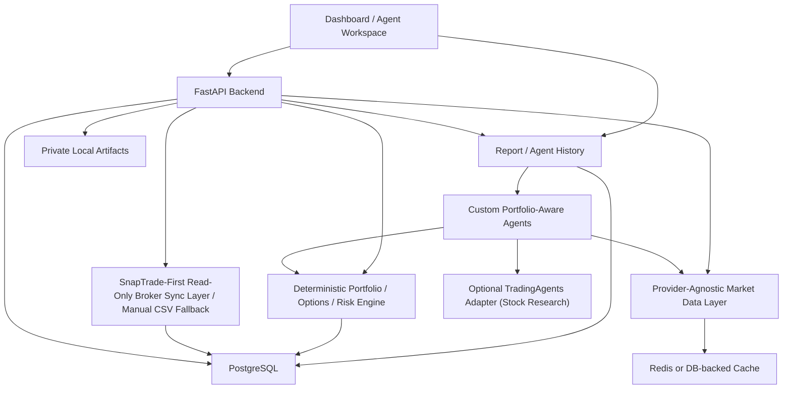

# portfolio-options-agent Architecture

Status: design document only. No business logic, database code, frontend code, or TradingAgents changes are authorized by this document.

This repository is intended to become a professional full-stack TradingAgents-inspired, portfolio-aware trade review agent team for manual investors. It should combine portfolio data, market context, deterministic risk calculations, trade-intent review, optional public research evidence, custom portfolio-aware agents, and durable report history into manual decision support. TradingAgents-inspired does not mean TradingAgents-centered: the product center remains broker-aware `TradeIntent` review. The dashboard is the cockpit, not the whole product. SnapTrade, market data providers, and TradingAgents are inputs/components, not the center of the system.

For context-efficient daily work, read `docs/shared/current_roadmap.md` first. Use `docs/shared/implementation_plan.md` for active and future tasks, `docs/shared/completed_phases_log.md` for archived verification history, and the role-specific folders under `docs/` for short Codex/Claude handoff briefs.

This is not financial advice. This project must not execute trades, store broker login credentials, scrape Fidelity, bypass MFA, promise returns, or present generated output as guaranteed investment guidance.

## Product North Star

The product north star is a TradingAgents-inspired, portfolio-aware trade review agent team for manual investors:

```text
portfolio system of record
+ market data context
+ proposed stock / ETF / option TradeIntent
+ deterministic trade-review and risk calculations
+ optional public stock/company research evidence
+ app-owned portfolio-aware agent team
+ durable report and agent history
= manual trade review and decision support
```

Before a user manually places a stock, ETF, or options trade, the system should help them understand how the proposed action affects portfolio context, cash, collateral, exposures, data freshness, and risk rules. It must not become only a SnapTrade dashboard, market data viewer, option-chain browser, wheel-strategy app, options-income app, CSP/covered-call screener, AI stock picker, automated trading system, or thin TradingAgents wrapper.

The core boundary remains: Python calculates financial metrics; LLMs explain structured results, compare tradeoffs, and compose reports. TradingAgents-style research/debate can inspire the workflow, but app-owned deterministic services and actionability policy remain authoritative.

Options remain the strongest wedge because option trades make portfolio impact, collateral, assignment, payoff, and data-freshness issues obvious. Covered calls and cash-secured puts are early high-value workflows, not the product identity. Long calls, long puts, stock buys/sells, ETF trades, collars, spreads, hedges, and future multi-leg strategies should fit the same trade-review architecture.

The core abstraction is `TradeIntent`, not wheel, CSP, or covered call. Core systems should store and evaluate `TradeIntent`, `StockTradeIntent`, `ETFTradeIntent`, `OptionStrategyIntent`, `OptionLeg`, scenario results, portfolio impact, risk-rule violations, report history, and journal/history links. Strategy-specific behavior belongs behind a `StrategyEvaluator` layer so future strategy wrappers can be added without rewriting the core engine.

## Executive Recommendations

| Area | Recommendation | Reason |
| --- | --- | --- |
| Backend | FastAPI | Python-native, async-friendly, good OpenAPI docs, compatible with deterministic analytics and agent orchestration. |
| Frontend | React + Vite for MVP; consider Next.js later | Vite is lighter for a one-developer internal dashboard. Next.js is useful later for auth-heavy or hosted public product surfaces. |
| Database | Start directly with PostgreSQL | The product is relational, multi-user, audit-heavy, and report-history-heavy. Avoid a painful SQLite-to-Postgres migration. |
| ORM/migrations | SQLAlchemy 2.x + Alembic | Industry-standard Python persistence with explicit schema evolution. |
| Local dev | Docker Compose Postgres + backend venv + frontend dev server | Professional, reproducible, and resume-friendly. |
| Background jobs | Simple database job table first; RQ/Celery later | The MVP needs resumable runs and visible state more than distributed scale. |
| Streaming | Server-Sent Events for agent progress first; WebSocket later if bidirectional market streaming is needed | SSE is simpler, works well for progress timelines, and avoids overbuilding. |
| Report and agent foundation | Build durable `report_threads`, `report_messages`, `agent_runs`, and `agent_steps` before TradingAgents integration | All future deterministic reports, custom agents, and TradingAgents outputs need a traceable home. |
| Market data layer | Provider-agnostic interfaces and a manual/mock provider before real provider integration | Do not couple Fidelity account management to quote data. Every quote must carry provider, timestamp, and freshness. |
| Broker portfolio sync | SnapTrade read-only as the primary broker portfolio sync path; manual input and Fidelity CSV import remain backup/fallback paths; long-term Akoya/Fidelity Access style permissioned data; Plaid Investments as fallback where coverage fits | Fidelity does not provide a simple public retail API. Broker holdings/cash freshness must be tracked separately from market quote freshness. No scraping, broker passwords, MFA bypass, or trading/order endpoints. |
| Agent team orchestration | Split Phase 16 into 16A deterministic components and 16B portfolio-aware team orchestration | Current deterministic agents are a foundation; the actual agent-team workflow needs explicit stage order, context envelopes, run/step persistence, fallbacks, and actionability enforcement. |
| TradingAgents integration | Optional dependency + adapter fallback after report/agent persistence exists. Local editable install for development; pinned Git/package extra for public users; no source copy, no submodule. | TradingAgents is a public stock/company research evidence stream, not the account-level decision engine. |
| MVP | Multi-user/multi-account portfolio system of record + broker freshness + manual/CSV fallback + report/agent history + deterministic trade-review/risk analytics + thin review workspace | Small enough to build, strong enough to demonstrate backend, fintech, data modeling, AI app engineering, and product judgment. |

## System Overview



## Layered Architecture

1. **Portfolio System of Record** - users, accounts, SnapTrade/manual/CSV input, cash balances, stock positions, option contracts, option positions, broker connections, broker accounts, broker sync runs, and broker freshness.
2. **Market Data Layer** - stock quotes, option quotes, option chains, IV, Greeks, provider metadata, quote timestamps, and quote freshness. This stays separate from broker portfolio sync.
3. **Trade Intent Review Layer** - `TradeIntent`, `StockTradeIntent`, `ETFTradeIntent`, `OptionStrategyIntent`, and `OptionLeg` capture what the user is considering before they manually act.
4. **Deterministic Trade/Risk Engine** - strategy-agnostic stock/ETF/options metrics, payoff scenarios, collateral, free cash, assignment/exercise scenarios, allocation/concentration impact, deterministic reports, and `risk_rule_violations`.
5. **Strategy Evaluator Layer** - plug-in deterministic wrappers such as stock buy/sell/trim, ETF review, long call, long put, cash-secured put, and covered call first, then protective puts, collars, vertical spreads, ETF overlays, and hedge analysis later. Wheel lifecycle is a composition of historical intents and strategy outputs, not the core architecture.
6. **Custom Portfolio-Aware Agents** - Phase 16A deterministic components such as Portfolio Context, Trade Review, Freshness/Guardrail, and Report Composer; Phase 16B app-owned agent-team orchestration with explicit stage order and context boundaries. These agents consume structured deterministic outputs and approved evidence.
7. **TradingAgents/Public Research Evidence Adapter** - optional asynchronous public stock/company research evidence stream for news, sentiment, fundamentals, and bull/bear debate. It does not own account-level risk decisions and is not in the fast path.
8. **Dashboard and Report History** - frontend cockpit, report threads, report messages, agent runs, agent steps, markdown reports, journal links, and later agent run monitor/report detail pages.

## Trade Intent Review Architecture

`TradeIntent` is the central domain concept for user-proposed actions. It represents a hypothetical manual trade that the app reviews before execution outside the app.

Core intent shapes:

- `TradeIntent`: shared id, user/account references, asset class, intent type, assumptions, notes, calculation version, and freshness snapshot.
- `StockTradeIntent`: buy, sell, trim, or add-to-position review for a stock.
- `ETFTradeIntent`: buy, sell, trim, or add-to-position review for an ETF.
- `OptionStrategyIntent`: one or more option legs tied to an underlying.
- `OptionLeg`: buy/sell, call/put, expiration, strike, quantity, premium/price assumption, multiplier, OCC symbol, and provider identifiers when safe.

Generic trade review pipeline:

1. Capture `TradeIntent`.
2. Resolve portfolio context.
3. Resolve market/quote snapshot.
4. Run deterministic calculations.
5. Run portfolio impact engine.
6. Run risk-rule engine.
7. Attach optional research evidence.
8. Generate deterministic report.
9. Let AI explain structured results.
10. Save to journal and report history.

Key app-owned modules:

- `PortfolioContextBuilder`
- `MarketSnapshotResolver`
- `TradeIntentValidator`
- `PayoffScenarioEngine`
- `PortfolioImpactEngine`
- `RiskRuleEngine`
- `ResearchEvidenceService`
- `ReportComposer`
- `JournalService`

Core tables should not be named around a single strategy family. Avoid `covered_call_candidates`, `csp_candidates`, `wheel_positions`, or `premium_income_strategy` as core schema foundations. Strategy-specific outputs should reference generic `TradeIntent`, `OptionLeg`, `ScenarioResult`, `PortfolioImpact`, `RiskRuleViolation`, report history, and journal/history records.

`StrategyEvaluator` remains useful, but as a wrapper around the trade-review pipeline:

```python
class StrategyEvaluator:
    def evaluate(
        self,
        intent: TradeIntent,
        portfolio_context: PortfolioContext,
        market_snapshot: MarketSnapshot,
    ) -> StrategyReview: ...
```

Early evaluators:

- `StockBuyReviewEvaluator`
- `StockSellTrimReviewEvaluator`
- `ETFReviewEvaluator`
- `LongCallReviewEvaluator`
- `LongPutReviewEvaluator`
- `CashSecuredPutEvaluator`
- `CoveredCallEvaluator`

Wheel lifecycle should be a later composition of historical trade intents, broker activities, assignments/exercises, stock ownership, and covered-call reviews. It should not become a core schema or product boundary.

Future extension: add a **Broker Activities / Transactions** layer after current-position sync and the deterministic risk engine are stable. Position/balance sync answers "what does the account currently hold?" while activities answer "what happened historically?" Activities can support realized premium tracking, assignment/exercise/expiration detection, dividends, interest, deposits, withdrawals, fees, and wheel lifecycle reconstruction. Activities must have their own freshness model because provider activity history may be cached, delayed, partial, or daily; it must not be treated as intraday real-time execution data. Store sanitized raw provider activities separately first, then normalize selected events into trades, premium income records, and wheel cycle records later. Keep read-only broker orders separate from activities.

## Deterministic vs LLM Boundary

The core rule is simple: Python code calculates; LLMs explain.

Deterministic Python should calculate stock/ETF trade impact, option payoff scenarios, annualized/simple return metrics when applicable, breakeven price, downside/upside boundaries, collateral requirements, assignment exposure, allocation drift, concentration risk, liquidity scores, bid-ask spread percentage, option collateral usage, free cash, projected allocation after assignment, and rule violations.

LLMs may summarize structured context, explain tradeoffs, produce final markdown reports, compare bullish and bearish narratives, and list questions or conditions for manual review. LLM output must cite deterministic fields by name and must not invent metrics. Avoid "you should buy/sell" phrasing, guaranteed-return language, and any implication that the app is placing or managing trades.

Personal allocation targets and strategy thresholds should be loaded from private config or database records. Public documentation and examples should use synthetic demo data only.

## Section A - Current Scaffold Analysis

### Current Structure

The current `portfolio-options-agent` scaffold contains:

```text
README.md
AGENTS.md
.gitignore
docs/codex-b-architecture/architecture.md
backend/
  README.md
  requirements.txt
  app/
    main.py
    core/
    db/
    models/
    schemas/
    api/
    services/
      portfolio/
      options/
      risk/
      market_data/
      broker_import/
      reports/
      agents/
      tradingagents_adapter/
  tests/test_health.py
frontend/README.md
examples/config.example.yaml
examples/portfolio.example.yaml
examples/strategy_rules.example.yaml
scripts/README.md
```

### Existing Documents

`README.md` correctly frames the repo as a manual trading decision-support platform, names key safety boundaries, explains the future TradingAgents relationship, and documents the minimal backend quickstart.

`AGENTS.md` correctly instructs future coding agents to prefer adapters over TradingAgents core edits, avoid API keys and real account data, avoid broker scraping and automatic trading, keep examples synthetic, and list changed files/tests after edits.

The prior `docs/codex-b-architecture/architecture.md` was intentionally a placeholder and is replaced by this design.

### Existing Backend

`backend/app/main.py` defines a minimal FastAPI app and `GET /health` endpoint returning:

```json
{"status":"ok"}
```

`backend/tests/test_health.py` verifies that endpoint with `fastapi.testclient.TestClient`.

### Current Gaps

- No SQLAlchemy/Alembic setup yet.
- No database models yet.
- No domain schemas yet.
- No account, portfolio, option, risk, market data, report, or agent-run APIs yet.
- No frontend build tooling yet.
- No job runner yet.
- No market data provider abstraction yet.
- No TradingAgents adapter implementation yet.
- No broker import parser yet.
- No security model beyond docs and `.gitignore`.

### Separation From TradingAgents

The scaffold is cleanly separated. It contains no TradingAgents source code, no submodule, and no vendored folder. The only TradingAgents reference is a future adapter package path: `backend/app/services/tradingagents_adapter/`.

### .gitignore Review

The `.gitignore` protects `.env` files, private configs, account YAMLs, broker credential YAMLs, root-level private data/report/import/export folders, local databases, CSV/QFX/OFX/PDF files, Python caches, virtualenvs, and frontend build artifacts.

Before implementation starts, improve it later with:

- `.envrc`, `.python-version` only if desired by tooling.
- `*.parquet`, `*.feather`, `*.xlsx`, `*.xls` for future exports/imports.
- `*.log.*` and crash dumps if needed.
- Root-only generated artifact rules should remain root-scoped so source packages such as `backend/app/services/reports/` are not accidentally ignored.

## Section B - TradingAgents Repository Analysis

This section is based on read-only inspection of `../TradingAgents`. Do not modify that repository for this project.

### Repository Shape

Key local files and directories:

```text
pyproject.toml
main.py
cli/
  main.py
  utils.py
  stats_handler.py
tradingagents/
  default_config.py
  graph/
  agents/
  dataflows/
  llm_clients/
tests/
LICENSE
README.md
```

`pyproject.toml` declares package name `tradingagents`, version `0.2.5`, and a console script `tradingagents = "cli.main:app"`. Dependencies include LangGraph, LangChain provider packages, Typer, Rich, yfinance, pandas, stockstats, requests, Redis, and the SQLite LangGraph checkpointer.

### CLI Entry Point and Terminal Input

The CLI is implemented in `cli/main.py` with Typer and Rich. It imports `TradingAgentsGraph` and `DEFAULT_CONFIG`, defines `app = typer.Typer(...)`, and uses `questionary`/`typer.prompt` for ticker, date, output language, analyst selection, research depth, LLM provider, model, and provider-specific reasoning settings.

This is the main source of terminal coupling:

- Interactive prompt flow: `get_user_selections()`
- Ticker/date input: `get_ticker()` and `get_analysis_date()`
- Save/display prompts after analysis
- Rich `Live` layout refresh during streaming

For this project, do not reuse the CLI. Use the package API through an adapter.

### Output Streaming and Refresh

`cli/main.py` creates a Rich layout with progress, messages/tools, current report, and footer stats. It streams LangGraph chunks via `graph.graph.stream(...)`, updates `MessageBuffer`, writes message/tool logs to disk, writes report sections as markdown, and refreshes the Rich `Live` display.

This explains the user pain point: terminal output is optimized for live display, not durable report review. The new app should store chunks in `agent_steps` and report messages as they arrive.

### Agents and Workflow

Agents are under `tradingagents/agents/`:

- `analysts/`: market, sentiment, news, fundamentals.
- `researchers/`: bull and bear researchers.
- `managers/`: research manager and portfolio manager.
- `trader/`: trader proposal.
- `risk_mgmt/`: aggressive, neutral, conservative debaters.
- `utils/`: agent state, tools, memory, structured output helpers.

Graph workflow is under `tradingagents/graph/`:

- `trading_graph.py`: main `TradingAgentsGraph` class.
- `setup.py`: LangGraph node and edge construction.
- `propagation.py`: initial state and graph invocation args.
- `conditional_logic.py`: debate continuation logic.
- `checkpointer.py`: optional SQLite checkpointing.
- `signal_processing.py`: final decision extraction.
- `reflection.py`: memory/reflection behavior.

The workflow is a sequential LangGraph:

```text
selected analysts -> Bull/Bear Researcher -> Research Manager -> Trader -> Risk analysts -> Portfolio Manager
```

The `TradingAgentsGraph` class constructs provider LLMs, creates tool nodes, compiles the graph, runs `propagate(company_name, trade_date)`, logs state to disk, and stores decision memory.

### LLM Providers and API Keys

LLM provider logic is under `tradingagents/llm_clients/`. The factory supports OpenAI-compatible providers, Anthropic, Google, and Azure. API key env var mapping is centralized in `api_key_env.py`. The package imports `.env` on package import via `tradingagents/__init__.py`.

For portfolio-options-agent, do not let TradingAgents own the top-level product LLM policy. Wrap it with this app's own provider abstraction, token budgets, cost logging, and retry logic.

### Data Sources

TradingAgents dataflows are under `tradingagents/dataflows/`. Current routing supports yfinance and Alpha Vantage categories:

- core stock OHLCV APIs
- technical indicators
- fundamentals
- news and insider data

The routing logic has fallback behavior for Alpha Vantage rate limits. It is useful for stock research, news, and fundamentals, but it is not an options-first real-time market data layer.

### Reports and Final Outputs

TradingAgents writes:

- final state JSON under its configured results directory
- CLI report markdown files under a user-selected report directory
- message/tool logs during CLI runs
- memory log under `~/.tradingagents/memory/trading_memory.md`
- optional checkpoint SQLite files under cache/checkpoints

The new app should not rely on these disk outputs as the primary user experience. It should map TradingAgents chunks into database-backed report threads, messages, agent steps, artifacts, token usage logs, and resumable job statuses.

### API Keys and Config Loading

TradingAgents loads API keys from environment variables and `.env`. It may prompt and save keys to `.env` in the CLI. This is acceptable for CLI use, but the full-stack app should handle keys in its own configuration layer:

- local `.env` for development
- encrypted secret store or hosted secret manager later
- metadata in database, never raw keys in database for MVP unless explicitly designed with encryption

### What Can Be Reused

- `TradingAgentsGraph` package API for stock-level multi-agent research.
- Existing analysts/researchers/managers as optional research workflow.
- LangGraph streaming/checkpoint concepts.
- Provider abstraction ideas.
- Token/tool stats callback pattern.
- Report section names as one possible mapping.

### TradingAgents Responsibility Boundary

TradingAgents should handle stock/company research narrative only:

- market, news, sentiment, and fundamentals research
- bull/bear stock research debate
- stock-level risk debate
- company/underlying research narrative that can be attached to an app-owned report

TradingAgents should not handle:

- multi-user or multi-account portfolio context
- SnapTrade, Fidelity CSV, manual input, or broker sync state
- account cash, free cash, option collateral, or assignment exposure
- covered call eligibility, CSP filtering, wheel lifecycle, or option strategy decisions
- allocation drift, sector concentration, or account-level risk limits
- broker sync freshness or market quote freshness
- final portfolio-aware conclusions

TradingAgents output is an optional asynchronous research evidence stream with a source such as `tradingagents_stock_research`. It should attach to ticker-level or company-level research records and reports after the deterministic fast path has already produced a portfolio-aware trade review. The app-owned custom agents and deterministic services decide how that evidence fits the account, cash, collateral, allocation, option exposure, and risk rules.

Do not send holdings, account values, cash balances, broker account ids, trade journal entries, or account-specific risk thresholds to TradingAgents or any LLM by default. When possible, send only ticker symbols and public company research context. Deep research should be user-triggered, budgeted, cacheable by ticker/research type/model/prompt version, and clearly labeled as evidence rather than the final portfolio-aware conclusion.

### What Is Too Generic or Expensive for This Use Case

- The CLI UX.
- One-shot stock analysis as the center of the product.
- LLM-driven final trading decisions without portfolio-aware deterministic guardrails.
- yfinance/Alpha Vantage as the only data layer for options decisions.
- Disk-first report persistence.
- Memory log as a markdown file rather than account/user-scoped structured history.
- Full multi-agent workflow for every ordinary portfolio refresh. Use it only when the user asks for research depth.

### What Should Be Wrapped Instead of Modified

Wrap:

- `TradingAgentsGraph`
- selected analyst configuration
- config dictionary construction
- streaming chunk parsing
- final-state parsing
- error and rate-limit handling
- output mapping to report threads and agent steps

Avoid modifying:

- `cli/main.py`
- `tradingagents/graph/setup.py`
- existing agent prompts
- `tradingagents/dataflows/interface.py`
- `tradingagents/default_config.py`

### Upstream Conflict Risk Classification

| Change type | Risk | Guidance |
| --- | --- | --- |
| New file in portfolio-options-agent adapter | No upstream conflict risk | Preferred. |
| Local editable install of sibling TradingAgents | No upstream conflict risk | Preferred for development. |
| Small upstream adapter hook or registration point | Low risk | Only if upstream accepts it or the fork patch is tiny. |
| Modifying TradingAgents CLI prompts/output | Medium risk | Avoid. Build app UX outside the CLI. |
| Modifying TradingAgents config defaults | Medium risk | Avoid; pass config from adapter. |
| Modifying graph node order/agent behavior | High risk | Avoid unless contributing upstream with tests. |
| Hardcoding personal strategies in TradingAgents | High risk | Never. Keep strategy rules private and app-owned. |

## Section B2 - TradingAgents Dependency and Integration Strategy

### Explicit Answers

| Question | Answer |
| --- | --- |
| A. Should portfolio-options-agent copy TradingAgents source code? | No. Do not copy or vendor it. |
| B. Should it use a git submodule? | No for now. It adds contributor friction and does not fit the current task. |
| C. Should it use sibling repo only? | Only for local development. Do not require public users to clone sibling repos. |
| D. Should it use pinned Git dependency? | Yes for public optional installs if no stable PyPI package is available or if a specific commit/tag is required. |
| E. Should it use optional dependency with adapter fallback? | Yes. This is the best architecture. Deterministic app features should work without TradingAgents installed. |

### Strategy Comparison

| Strategy | Install UX | Maintainability | Upstream updates | License clarity | Public GitHub fit | Hosted product fit | Resume value |
| --- | --- | --- | --- | --- | --- | --- | --- |
| Sibling repo only | Poor for public users | Good locally | Excellent locally | Clear | Poor | Poor | Shows local workflow, not product polish |
| Python package dependency | Best if available | Good | Controlled by version pins | Clear | Excellent | Good | Professional |
| Pinned Git dependency | Good | Good if pinned | Controlled upgrades | Clear | Good | Good for early stages | Professional and reproducible |
| Git submodule | Confusing for many users | Medium | Pinned but extra workflow | Clear | Mixed | Mixed | Less polished |
| Git subtree | Clone-friendly | Harder over time | Merge conflicts likely | More complex | Mixed | Poor unless justified | Less clean |
| Direct source copy | Easy first clone | Bad | Bad | Riskier notices | Poor | Poor | Looks amateurish for this case |
| Reimplement workflow | Good after mature | High effort | No upstream benefit | Clear | Good if executed | Good | Strong but not MVP |

### Recommended Modes

Current local development:

```bash
cd /Users/wulingyun/Desktop/Trading_Agents_Projects/portfolio-options-agent/backend
python -m pip install -e ../TradingAgents
```

Public open-source release:

```toml
[project.optional-dependencies]
tradingagents = [
  "tradingagents @ git+https://github.com/TauricResearch/TradingAgents.git@v0.2.5"
]
```

If TradingAgents later publishes stable PyPI releases:

```toml
[project.optional-dependencies]
tradingagents = ["tradingagents==0.2.5"]
```

Future hosted product:

- Pin TradingAgents to a known-good commit/tag in lockfiles.
- Disable TradingAgents workflows by default unless configured.
- Run it in isolated workers with rate limits and per-run budgets.
- Consider an internal fork only if small compatibility patches are needed and upstream cannot accept them quickly.

### Adapter Layer

Recommended future locations:

```text
backend/app/services/tradingagents_adapter/
  __init__.py
  client.py
  exceptions.py
  models.py
  parser.py
  prompts.py
  versioning.py
backend/tests/services/test_tradingagents_adapter.py
```

Adapter methods:

```python
class TradingAgentsAdapter:
    def is_available(self) -> bool: ...
    def get_version(self) -> str | None: ...
    def run_stock_research(self, request: StockResearchRequest) -> StockResearchResult: ...
    def run_market_brief(self, request: MarketBriefRequest) -> MarketBriefResult: ...
    def run_agent_workflow(self, request: AgentWorkflowRequest) -> AgentWorkflowResult: ...
    def parse_agent_outputs(self, raw_state: dict) -> ParsedTradingAgentsOutput: ...
    def map_to_report_thread(self, parsed: ParsedTradingAgentsOutput) -> ReportThreadDraft: ...
```

Error handling:

- Catch `ImportError` inside the adapter only.
- Raise `TradingAgentsUnavailableError` with actionable instructions.
- API response should say: deterministic analytics are still available; install optional dependency for TradingAgents research.
- Do not import TradingAgents in global FastAPI startup paths unless the feature is enabled.

Example user-facing message:

```text
TradingAgents integration is not installed. Portfolio analytics, option screening,
cash collateral, assignment scenarios, and report history still work.
For local development run: python -m pip install -e ../TradingAgents
For public install run: python -m pip install "portfolio-options-agent[tradingagents]"
```

Testing:

- Unit tests mock `TradingAgentsGraph` with a fake module injected through monkeypatch.
- Tests verify missing dependency behavior.
- Tests verify local editable install detection.
- Tests verify parsed output maps to report threads/messages/agent steps.
- Contract tests should run manually or in optional CI with TradingAgents installed.

Upgrade policy:

- Record supported TradingAgents versions in `versioning.py`.
- Pin optional dependency for releases.
- Add a compatibility test fixture with sample final state shapes.
- Upgrade in a branch: bump pin, run adapter contract tests, update parser if state keys changed, then release.

## Section C - Target Architecture

### Backend Options

| Backend | Pros | Cons | Recommendation |
| --- | --- | --- | --- |
| FastAPI | Python-native, typed schemas, async, OpenAPI, good for LLM/data integrations | Requires choosing ORM/auth/job patterns | Use. |
| Flask | Simple | More manual structure, weaker async/OpenAPI story | Not ideal for this project. |
| Django | Batteries included, admin/auth mature | Heavier, less natural for async agents and typed APIs | Consider only if admin/auth dominates later. |

FastAPI is the right default because the project is Python-heavy, agent-heavy, and API-first.

### Frontend Options

| Frontend | Pros | Cons | Recommendation |
| --- | --- | --- | --- |
| React + Vite | Lightweight, fast local dev, dashboard-friendly | Need to choose routing/data libraries | MVP recommendation. |
| Next.js | Full-stack web features, SSR, auth/product pages | More framework surface area | Later if hosted/public app needs it. |
| Plain HTML/templates | Fast start | Poor resume/full-stack signal | Avoid for this product. |

### Database Options

Use PostgreSQL for durable app data. Use Redis later for ephemeral cache/queue coordination if needed. Keep large raw import files and exported reports in private object/file storage with database metadata.

### Job Options

| Option | Pros | Cons | Recommendation |
| --- | --- | --- | --- |
| Database job table | Simple, visible, transactional, easy resume model | Limited scale | MVP. |
| FastAPI background tasks | Easy | Fragile on process restart | Use only for tiny noncritical tasks. |
| RQ + Redis | Simple worker queue | Redis dependency | Phase 2 or 3 if background work grows. |
| Celery + Redis/RabbitMQ | Mature | More operational complexity | Later hosted product. |
| Dramatiq | Clean Python queue | Less common than Celery | Later option. |

### Streaming Options

| Option | Pros | Cons | Recommendation |
| --- | --- | --- | --- |
| Polling | Simple | Less responsive, wasteful | Acceptable fallback. |
| Server-Sent Events | Simple one-way progress stream, browser-native | One-way only | MVP for agent progress. |
| WebSocket | Bidirectional, good for live quotes | More stateful infrastructure | Later for active option-chain pages. |

## Section D - Database Decision

### Comparison

| Store | Multi-user/account | Relational portfolio data | Report/chat history | Delete/restore | Queries | Deployment | Integrity | Fit |
| --- | --- | --- | --- | --- | --- | --- | --- | --- |
| PostgreSQL | Excellent | Excellent | Excellent with JSONB where useful | Strong | Strong SQL | Standard | Strong constraints/transactions | Best |
| SQLite | Fine for local single-user | Moderate | Moderate | Manual limits | Good but limited concurrency | Easy local, weaker hosted | Weaker concurrent writes | Prototype only |
| MongoDB | Good | Weaker relational joins | Good document history | Good | Different modeling tradeoffs | Standard | Flexible but fewer relational guarantees | Not best for portfolio records |
| YAML/CSV | Poor | Poor | Poor | Manual | Poor | Not scalable | Weak | Examples/import/export only |

### Recommendation

Start directly with PostgreSQL. The product has users, accounts, positions, contracts, trades, imports, reports, messages, agent steps, audit logs, and market data snapshots. These are relational records with integrity requirements.

Starting with SQLite is tempting, but migration later can become painful when Postgres-specific features are needed: JSONB indexes, row locking for job claims, concurrent writes, case-insensitive indexes, partial indexes for soft delete, and richer constraints.

Alembic solves schema evolution by versioning DDL changes. It does not remove the need to design data boundaries carefully. It helps add tables, columns, indexes, constraints, and data migrations in a controlled way.

Schema choices that reduce future pain:

- UUID primary keys for app entities.
- `created_at`, `updated_at`, and `deleted_at` where user deletion matters.
- Normalize stable entities such as users, accounts, positions, contracts, trades.
- Use JSONB for provider payloads, run metadata, calculation input snapshots, and artifact metadata.
- Store user/account IDs on all sensitive records.
- Avoid storing raw API keys in ordinary tables.
- Add provider/timestamp/freshness to every quote.
- Version strategy rules and report input snapshots.

File-based data that can remain outside the database:

- Raw uploaded CSV/PDF/XLSX files, stored privately with metadata in `broker_import_files`.
- Exported markdown/PDF artifacts, stored privately with metadata in `report_artifacts`.
- Synthetic example YAML files.
- Local developer `.env` files.

Data that should definitely be in PostgreSQL:

- Users, accounts, account settings and permissions.
- Cash balances, positions, trades, option contracts.
- Strategy rules, risk limits, target allocations.
- Report threads/messages, agent runs/steps, audit logs.
- Import metadata, validation results, duplicate detection records.
- Market data cache metadata and quote snapshots needed for traceability.

## Section E - Database Schema

Global conventions:

- Primary key: `id UUID PRIMARY KEY`.
- Common timestamps: `created_at TIMESTAMPTZ NOT NULL`, `updated_at TIMESTAMPTZ NOT NULL`.
- Soft delete for user-facing sensitive content: `deleted_at TIMESTAMPTZ`, `deleted_by UUID NULL`.
- Use `JSONB` for provider payloads, rule parameters, input snapshots, and validation details.
- Use `NUMERIC` for money/price/quantity when exactness matters.
- Use `TEXT` plus check constraints or enums for status/type fields at first; graduate to Postgres enums if values stabilize.

| Table | Purpose | Key columns, PK, FKs | Indexes and constraints | Notes and migration risks |
| --- | --- | --- | --- | --- |
| `users` | Local users now, real auth users later | `id`; `display_name`; `email`; `auth_provider`; `is_active`; timestamps; soft delete | Unique lower email when email is not null; index `is_active` | Keep auth minimal in MVP. Do not bake in a SaaS-only auth assumption. |
| `accounts` | Brokerage or manual account container | `id`; `user_id -> users.id`; `broker_name`; `account_type`; `display_name`; `base_currency`; `is_manual`; timestamps; soft delete | Index `user_id`; unique `(user_id, display_name)` where not deleted | Account type should support taxable, Roth IRA, traditional IRA, other. |
| `account_settings` | Per-account preferences | `id`; `account_id -> accounts.id`; `settings JSONB`; timestamps | Unique `account_id`; GIN on `settings` later if queried | Keep flexible until UX stabilizes. |
| `account_permissions` | Future shared access | `id`; `account_id`; `user_id`; `role`; `granted_by`; timestamps | Unique `(account_id, user_id, role)`; indexes account/user | Not needed for MVP UX but table design supports later sharing. |
| `target_allocations` | Account target bands | `id`; `account_id`; `asset_key`; `asset_type`; `target_pct`; `min_pct`; `max_pct`; `metadata JSONB`; `effective_from`; timestamps | Unique `(account_id, asset_key, effective_from)`; check min <= target <= max | Do not hardcode personal targets. Load from private config/UI. |
| `risk_limits` | Account risk guardrails | `id`; `account_id`; `rule_key`; `severity`; `params JSONB`; `enabled`; `version`; timestamps | Unique `(account_id, rule_key, version)`; index enabled | Version rules so historical reports remain explainable. |
| `strategy_rules` | Account strategy config | `id`; `account_id`; `strategy_key`; `params JSONB`; `enabled`; `version`; timestamps | Unique `(account_id, strategy_key, version)` | Store thresholds as private account data, not code defaults. |
| `cash_balances` | Cash categories over time | `id`; `account_id`; `as_of`; `total_cash`; `reserved_option_collateral`; `free_cash`; `premium_income_cash`; `dca_cash`; `assignment_reserved_cash`; `source`; timestamps | Index `(account_id, as_of DESC)`; unique `(account_id, as_of, source)` | Values can be snapshots; derived fields can be recomputed but snapshots aid audit. |
| `stock_positions` | Equity/ETF/mutual fund holdings | `id`; `account_id`; `symbol`; `asset_type`; `quantity`; `cost_basis`; `market_price`; `market_value`; `sector`; `industry`; `as_of`; timestamps; soft delete | Index `(account_id, symbol)`; unique active `(account_id, symbol, as_of)` optional | Tax lots can be added later as child table. |
| `option_contracts` | Normalized option contract identity | `id`; `underlying_symbol`; `occ_symbol`; `expiration_date`; `strike`; `option_type`; `multiplier`; `style`; timestamps | Unique `occ_symbol`; index `(underlying_symbol, expiration_date, strike, option_type)` | Important for joining quotes and positions. OCC symbology details must be tested. |
| `option_positions` | Open/closed option holdings | `id`; `account_id`; `option_contract_id`; `position_type`; `quantity`; `average_price`; `opened_at`; `closed_at`; `status`; timestamps; soft delete | Index account/status; index contract; check quantity nonzero | Short puts drive collateral; short calls need covered-call eligibility. |
| `trades` | Manual trade journal | `id`; `account_id`; `symbol`; `option_contract_id NULL`; `trade_type`; `side`; `quantity`; `price`; `fees`; `trade_time`; `notes`; `source`; timestamps | Index `(account_id, trade_time DESC)`; idempotency key unique per import | No auto-execution. Trades are records of manual actions/imports. |
| `transaction_imports` | Batch import sessions | `id`; `account_id`; `broker_import_file_id`; `status`; `started_at`; `completed_at`; `summary JSONB`; timestamps | Index account/status | Distinguish file upload from parsed transaction batch. |
| `broker_import_files` | Uploaded broker file metadata | `id`; `account_id`; `broker_name`; `file_name`; `file_type`; `storage_uri`; `sha256`; `status`; `validation_errors JSONB`; timestamps; soft delete | Unique `(account_id, sha256)`; index account/status | Raw files should live in private storage, not git. |
| `broker_connections` | User-permissioned broker/aggregator connection metadata | `id`; `user_id -> users.id`; `provider`; `broker_name`; `provider_connection_id`; `connection_status`; `sync_status`; `data_freshness_status`; `last_successful_sync_at`; `last_attempted_sync_at`; `consent_expires_at`; `secret_ref`; `scopes TEXT[]`; `raw_metadata JSONB`; timestamps; soft delete | Unique `(provider, provider_connection_id)`; index `(user_id, provider, connection_status)` | Store secret references only. Never store Fidelity usernames/passwords. Use OAuth/Fidelity Access/user-permissioned flows only. |
| `broker_accounts` | Provider account mapping for synced broker accounts | `id`; `broker_connection_id -> broker_connections.id`; `account_id -> accounts.id NULL`; `provider_account_id`; `display_name`; `account_type`; `base_currency`; `sync_status`; `data_freshness_status`; `last_successful_sync_at`; `raw_payload JSONB`; timestamps; soft delete | Unique `(broker_connection_id, provider_account_id)`; index mapped `account_id` | Keeps provider identity separate from internal account identity; supports remapping and manual accounts. |
| `broker_sync_runs` | Individual broker sync attempts | `id`; `broker_connection_id`; `broker_account_id NULL`; `trigger`; `status`; `started_at`; `completed_at`; `provider_request_id`; `accounts_count`; `positions_count`; `transactions_count`; `error JSONB`; `summary JSONB`; timestamps | Index connection/time; index status | Status examples: queued, running, succeeded, failed, partially_succeeded, cancelled. Needed for observability and retries. |
| `watchlists` | User/account watchlists | `id`; `user_id`; `account_id NULL`; `name`; timestamps; soft delete | Unique `(user_id, name)` active | Watchlists can be account-specific or user-level. |
| `watchlist_items` | Symbols/contracts in watchlists | `id`; `watchlist_id`; `symbol`; `option_contract_id NULL`; `notes`; timestamps | Unique `(watchlist_id, symbol, option_contract_id)` | Later add sort order and tags. |
| `portfolio_snapshots` | Traceable account summary snapshots | `id`; `account_id`; `as_of`; `input_hash`; `summary JSONB`; `calculation_version`; timestamps | Index `(account_id, as_of DESC)`; unique `(account_id, input_hash)` | Store deterministic calculation outputs used by reports. |
| `assignment_scenarios` | Projected assignment outcomes | `id`; `account_id`; `portfolio_snapshot_id`; `scenario_name`; `inputs JSONB`; `results JSONB`; timestamps; soft delete | Index account/snapshot | Keep full input snapshot for reproducibility. |
| `premium_income_records` | Premium received/realized tracking | `id`; `account_id`; `option_position_id`; `trade_id`; `amount`; `realized_at`; `status`; `cycle_id`; timestamps | Index `(account_id, realized_at DESC)`; index cycle | Wheel lifecycle can use `cycle_id` before a formal cycles table exists. |
| `agent_runs` | Background analysis runs | `id`; `user_id`; `account_id NULL`; `report_thread_id NULL`; `run_type`; `status`; `provider`; `model`; `token_budget`; `cost_budget`; `input_snapshot_json JSONB`; `output_snapshot_json JSONB`; `calculation_version`; `data_freshness_snapshot JSONB`; `started_at`; `completed_at`; `error JSONB`; timestamps | Index status; index user/account; index report thread | Status: queued, running, waiting_retry, failed, cancelled, completed, partially_completed. Snapshots make every run traceable. |
| `agent_steps` | Step-by-step run trace | `id`; `agent_run_id`; `step_order`; `step_key`; `step_type`; `status`; `started_at`; `completed_at`; `input_snapshot_json JSONB`; `output_snapshot_json JSONB`; `calculation_version`; `data_freshness_snapshot JSONB`; `error JSONB`; `tokens_in`; `tokens_out`; `estimated_cost`; timestamps | Unique `(agent_run_id, step_order)`; index run/status | Store enough to debug without leaking into public artifacts. |
| `report_threads` | Chat-like report container | `id`; `user_id`; `account_id NULL`; `agent_run_id NULL`; `title`; `status`; `tags TEXT[]`; `deleted_at`; timestamps | Index user/account/status; GIN tags later | Minimal soft-delete placeholder starts with `deleted_at`; restore/permanent delete behavior is deferred. |
| `report_messages` | Chat/report timeline messages | `id`; `thread_id`; `sender_type`; `message_type`; `content_markdown`; `content_json JSONB`; `sequence`; `visibility`; timestamps; soft delete | Unique `(thread_id, sequence)`; index message type | Message types include user_input, system_event, agent_output, tool_output, error, retry_notice, final_report, markdown_report. |
| `report_artifacts` | Exported files and generated artifacts | `id`; `thread_id`; `artifact_type`; `file_name`; `storage_uri`; `mime_type`; `sha256`; `metadata JSONB`; timestamps; soft delete | Index thread/type; unique sha per thread optional | Delete artifacts with thread purge; soft delete metadata for trash restore. |
| `api_usage_logs` | Provider usage and cost trace | `id`; `user_id`; `account_id NULL`; `agent_run_id NULL`; `provider`; `model`; `operation`; `tokens_in`; `tokens_out`; `request_count`; `estimated_cost`; `status`; timestamps | Index provider/time; index run | Do not store raw prompts here; link to step if needed. |
| `audit_logs` | Security and important action history | `id`; `actor_user_id`; `account_id NULL`; `action`; `entity_type`; `entity_id`; `metadata JSONB`; `ip_hash`; timestamps | Index actor/time; index entity | Record deletes/restores/imports/settings changes. |
| `market_data_cache` | Generic cache metadata | `id`; `provider`; `cache_key`; `data_type`; `payload JSONB`; `fetched_at`; `expires_at`; `freshness_status`; timestamps | Unique `(provider, cache_key)`; index expires | Useful before Redis; later can move hot data to Redis. |
| `option_chain_cache` | Option-chain snapshots | `id`; `provider`; `underlying_symbol`; `expiration_date`; `snapshot_time`; `freshness_status`; `payload JSONB`; timestamps | Index `(underlying_symbol, expiration_date, snapshot_time DESC)` | Large payloads may move to object storage if too big. |
| `stock_quotes` | Stock quote snapshots | `id`; `provider`; `symbol`; `bid`; `ask`; `last`; `mark`; `quote_time`; `received_at`; `freshness_status`; `raw_payload JSONB`; timestamps | Index `(symbol, quote_time DESC)`; index provider | Never assume quote is live; freshness is explicit. |
| `option_quotes` | Option quote snapshots | `id`; `provider`; `option_contract_id`; `bid`; `ask`; `last`; `volume`; `open_interest`; `iv`; `delta`; `gamma`; `theta`; `vega`; `rho`; `underlying_price`; `quote_time`; `received_at`; `freshness_status`; `raw_payload JSONB`; timestamps | Index `(option_contract_id, quote_time DESC)`; provider index | Greeks may be provider-supplied or app-calculated; store `greeks_source`. |
| `provider_credentials_metadata` | Secret metadata, not raw secrets | `id`; `user_id NULL`; `provider`; `credential_name`; `secret_ref`; `scopes TEXT[]`; `status`; `last_tested_at`; timestamps; soft delete | Unique `(user_id, provider, credential_name)` active | Store secret references only. Raw keys in `.env` or secret manager. |

## Section F - Report and Chat History Design

Each analysis run should create or append to a `report_thread`. For MVP, create one thread per run. Later, a thread may contain follow-up questions and re-runs.

Core entities:

- `report_threads`: title, account, status, tags, and `deleted_at` for minimal soft delete.
- `report_messages`: user input, system events, agent outputs, tool outputs, errors, retry notices, final markdown.
- `agent_runs`: execution status, budgets, provider/model summary, `input_snapshot_json`, `output_snapshot_json`, `calculation_version`, and `data_freshness_snapshot`.
- `agent_steps`: checkpointable step outputs, token usage, cost, errors, `input_snapshot_json`, `output_snapshot_json`, `calculation_version`, and `data_freshness_snapshot`.
- `report_artifacts`: markdown export now, PDF later.

Deletion behavior:

- Phase 10 should add only the minimal `report_threads.deleted_at` soft-delete placeholder.
- Full restore and permanent-delete behavior is deferred until the report workspace matures.
- Later restore clears `deleted_at` on thread/messages/artifacts.
- Later permanent delete removes message content, step payloads linked only to that report, and artifact files.
- Preserve aggregate `api_usage_logs` if content is scrubbed, unless user requests full account purge.
- Avoid orphan records with FK constraints and application-level purge jobs.

Frontend behavior:

- Report History page lists title, account, ticker/strategy, date, status, provider/model, estimated cost, tags, and actions.
- Report Detail page shows a chat-like timeline plus collapsible agent steps.
- Failed runs are visible with error step and retry history.
- Export markdown returns the final markdown message plus deterministic tables.
- PDF export later should render markdown to a private artifact and record it in `report_artifacts`.

API behavior:

- `DELETE /reports/{thread_id}` soft deletes.
- `POST /reports/{thread_id}/restore` restores if within retention.
- `DELETE /reports/{thread_id}/permanent` hard deletes sensitive content.
- `GET /reports/{thread_id}/export/markdown` streams markdown from database content.

## Section G - User, Account, and Portfolio Model

Each user owns many accounts. Each account belongs to one user, with optional future shared permissions.

Account types:

- taxable individual
- Roth IRA
- traditional IRA
- other

Account fields:

- broker name
- account type
- base currency
- cash balances
- stock positions
- option positions
- target allocation
- risk limits
- strategy rules
- reports
- trade journal
- assignment exposure
- option collateral usage
- premium income records

Cash categories:

- `total_cash`: all cash shown by account/import.
- `reserved_option_collateral`: cash reserved for open short puts.
- `assignment_reserved_cash`: cash needed if all short puts are assigned.
- `free_cash`: cash not reserved for collateral or other configured uses.
- `premium_income_cash`: premium received and optionally tracked separately.
- `dca_cash`: cash available for DCA/buy-the-dip planning.

User-level aggregate exposure should roll up accounts while preserving account-specific restrictions. For example, an IRA may have different option permissions and tax treatment than a taxable account. Do not assume every account supports every strategy.

## Section H - Portfolio Allocation Engine

The allocation engine should be deterministic and testable.

Inputs:

- latest cash balance snapshot
- stock positions
- option positions
- option contract metadata
- latest quote snapshots with freshness
- target allocations and risk limits
- sector/industry classification metadata

Core outputs:

- total account value
- invested assets
- total cash
- reserved collateral
- free cash
- premium income cash
- ETF allocation
- single-stock allocation
- option notional exposure
- sector exposure
- technology exposure
- semiconductor exposure
- target allocation drift
- projected allocation after assignment
- projected cash after assignment
- rule violations
- `risk_rule_violations` with severity `info`, `warning`, `violation`, or `blocker`

Target allocation model:

```yaml
target_allocations:
  - asset_key: DEMO_CORE_ETF
    target_pct: 0.33
    min_pct: 0.28
    max_pct: 0.38
  - asset_key: DEMO_OPTIONS_CASH_RESERVE
    target_pct: 0.33
    min_pct: 0.25
    max_pct: 0.40
```

The public repo should use synthetic asset keys. Real allocation targets belong in private database records or private config files.

Flags:

- underweight core ETF
- overweight sector ETF
- too little free cash
- too much option collateral
- too much assignment exposure
- too much high-beta technology exposure
- too much semiconductor exposure
- too much single-name exposure
- allocation outside configured bands

## Section I - Options and Wheel Strategy Engine

This engine should be a deterministic analytics engine, not an auto-trader.

### Cash-Secured Puts

Candidate screening should:

- Load chain snapshots by expiration.
- Filter by user-configured DTE range.
- Filter by user-configured IV, volume, open interest, spread, and probability thresholds.
- Require enough cash collateral.
- Check assignment scenario.
- Check earnings/macro/event risk metadata when available.
- Flag stale/delayed/EOD-only quotes as not immediately actionable.
- Never place an order.

### Covered Calls

Covered-call logic should:

- Detect at least 100 shares per call contract.
- Calculate premium yield and call-away scenario.
- Check whether selling calls conflicts with long-term holding intent.
- Respect account and strategy rules.
- Flag strong-breakout risk only from deterministic indicators or configured analyst notes, not LLM invention.

### Wheel Lifecycle

Lifecycle states:

```text
short_put_opened -> premium_received -> monitored -> close_candidate
  -> roll_candidate -> assigned -> cost_basis_updated
  -> covered_call_stage -> called_away -> cycle_closed
```

Track:

- entry credit
- current debit to close
- realized premium
- unrealized premium
- assignment
- stock cost basis after assignment
- covered-call credits
- called-away proceeds
- cycle-level P/L

### Formula Sketches

Use option multiplier, usually 100, from `option_contracts.multiplier`.

```text
mid = (bid + ask) / 2
bid_ask_spread_pct = (ask - bid) / mid
premium_yield = (premium_mid * multiplier * contracts) / cash_collateral_required
annualized_roi = premium_yield * (365 / dte)
cash_collateral_required = strike * multiplier * abs(short_put_contracts)
breakeven_price = strike - premium_received_per_share
downside_buffer_pct = (underlying_price - breakeven_price) / underlying_price
assignment_exposure = strike * multiplier * abs(short_put_contracts)
free_cash_after_collateral = total_cash - reserved_collateral - new_collateral
premium_capture_pct = (entry_credit - current_debit_to_close) / entry_credit
early_close_candidate = premium_capture_pct >= configured_close_threshold
```

Probability estimates:

- If provider supplies probability OTM, store provider value and provider method.
- If provider supplies delta only, approximate short-put assignment probability with `abs(put_delta)` and label it `delta_approximation`.
- If app calculates Black-Scholes probability, use deterministic inputs: underlying, strike, DTE, IV, risk-free rate, dividend yield. Store assumptions and calculation version.
- For a put under Black-Scholes risk-neutral approximation: probability ending OTM is approximately `N(d2)`; probability ITM/assignment proxy is `N(-d2)`.

Liquidity score example:

```text
liquidity_score = weighted_score(
  normalized_volume,
  normalized_open_interest,
  inverse_spread_pct,
  quote_recency,
  bid_positive_flag
)
```

Risk/reward score should be a transparent weighted score from deterministic features. Do not hide weights in code; load from rules.

Projected allocation after assignment:

1. Convert each open short put into hypothetical stock position at strike.
2. Reduce cash by assignment exposure.
3. Recalculate market value, sector exposure, ETF/core allocation, and single-name exposure.
4. Compare against risk limits and target bands.

## Section J - Market Data and Option Chain Data

The app needs its own provider-agnostic market data layer. It should not depend on Fidelity for market data.

### Data Modes

| Mode | Meaning | UI behavior |
| --- | --- | --- |
| `eod` | End-of-day or previous close data | Research only; no immediate trade label. |
| `delayed_snapshot` | Snapshot delayed by provider/exchange rules | Warn user; require broker refresh before manual trade. |
| `live_snapshot` | Current provider snapshot with acceptable recency | Still require broker confirmation. |
| `streaming` | Live stream for actively viewed symbols/contracts | Show live badge and timestamp; stream only active view. |
| `stale` | Data older than freshness policy | Disable actionable language. |

### Provider Interface

```python
class MarketDataProvider:
    def get_stock_quote(self, symbol: str) -> StockQuote: ...
    def get_stock_quotes(self, symbols: list[str]) -> list[StockQuote]: ...
    def get_intraday_bars(self, symbol: str, interval: str) -> list[Bar]: ...

class OptionDataProvider:
    def get_option_expirations(self, symbol: str) -> list[date]: ...
    def get_option_chain(self, symbol: str, expiration: date) -> OptionChain: ...
    def get_option_snapshot(self, option_symbol: str) -> OptionQuote: ...
    def stream_option_quotes(self, option_symbols: list[str]) -> AsyncIterator[OptionQuote]: ...

class GreeksProvider:
    def calculate_iv_and_greeks_if_missing(
        self,
        contract: OptionContract,
        quote: OptionQuote,
        underlying_price: Decimal,
    ) -> GreeksResult: ...
```

Every quote record must include:

- provider
- provider account/plan if relevant
- quote timestamp
- received timestamp
- freshness status
- data mode
- raw payload
- provider terms/licensing notes if needed

### Provider Comparison

External provider details change often. Recheck pricing, licensing, and redistribution rights before purchase or public launch.

| Provider | Stock quotes | Options chains | IV/Greeks | Streaming | Historical options | Cost/profile | MVP fit | Long-term fit |
| --- | --- | --- | --- | --- | --- | --- | --- | --- |
| yfinance | Good for casual historical/EOD; may expose live-ish fields | Basic option chains but not robust professional OPRA feed | Limited/unreliable for production | WebSocket exists, but legal/use constraints remain | Limited | Free, personal/research oriented | Cheap fallback only | Not product-grade |
| Alpha Vantage | Stock data and indicators | Historical options chain endpoint | Historical IV/Greeks per docs | Not primary for live options | Yes, historical options since 2008 per docs | Free/paid API limits | Useful fallback for historical option context | Not main live provider |
| Tradier | Quotes and market endpoints | Option chains/expirations | Greeks and IV in chains via ORATS when requested | Market WebSocket available; sandbox delayed | Some historical/time-sales support | Good developer API; brokerage account may unlock real-time | Strong MVP candidate for options chain snapshots | Good if licensing/account fit works |
| Alpaca | Stock data API | Options snapshots/chains/quotes | Depends on endpoint/feed; OPRA plan matters | Options WebSocket, indicative or OPRA feed | Historical options since 2024 in docs | Basic free, OPRA through paid plan | Good if already comfortable with Alpaca data | Good for active dashboard streaming |
| Polygon / Massive | Strong stocks/options APIs | Strong options references/snapshots | Greeks, IV, OI in paid plans | Options WebSocket | Paid historical depth | Transparent paid tiers | Good if budget allows | Strong long-term product data layer |
| Interactive Brokers | Good if user has subscriptions | Contract/market data via TWS/API | Greeks through option computation ticks with required subscriptions | TWS/API streaming | Available but API ergonomics can be complex | Requires account, TWS/Gateway, data subscriptions | Not first MVP unless user already uses IBKR | Useful advanced adapter for users with IBKR |
| ORATS | Options-focused | Strong options data | Strong proprietary IV/Greeks | Live/delayed APIs | Deep history to 2007 | Paid, options specialist | Good for analytics if budget allows | Strong options research provider |
| ThetaData | Options-focused | Chain snapshots and ticks | Broad Greeks including higher-order | Real-time and historical streaming/ticks by tier | Deep history | Paid retail tiers; local terminal required | Excellent data quality but operationally heavier | Strong for serious options analytics |
| Cboe DataShop / Cboe feeds | Official exchange-grade datasets | Options quotes/trades intervals and feeds | Data products vary | Professional feeds | Strong historical datasets | Enterprise/licensing heavy | Not MVP | Enterprise/compliance path |
| Finnhub | Stock/news/fundamentals focus | Option-chain support should be verified for needs | Not first choice for Greeks-heavy workflow | WebSocket for some data | Verify | Freemium/paid | Not primary | Possible supplemental news/stock provider |
| Schwab Trader API | Relevant if user has Schwab | Option chains may be available to approved API users | Schwab platforms show Greeks; API capabilities need verification | Streaming docs less polished publicly | Verify | Account/API approval dependent | Not for Fidelity manual MVP | Future broker/data adapter only |

### Cache and Fallback

Cache policy:

- Stock quotes: short TTL, e.g. 5-30 seconds in live mode, longer in delayed/EOD mode.
- Option chain snapshots: TTL by provider mode and page state, e.g. 15-60 seconds while active, longer for research.
- Historical bars: cache by symbol/interval/date range.
- Provider status: cache rate-limit and outage state.

Fallback policy:

1. Use configured primary provider.
2. If rate-limited or down, use configured fallback only if it meets required data mode.
3. Never silently downgrade live to delayed without marking freshness and warning the user.
4. If stale, final report should say refresh in broker before manual trade.

Streaming policy:

- Stream only symbols/contracts the user is viewing.
- Do not stream the entire option market.
- Store only useful snapshots or downsampled events unless a user explicitly records a session.

### Market Data Timing Decision

Architecture decision: see `docs/codex-b-architecture/adr/0003-market-data-timing-tradier-rest-snapshots.md`.

Real market-data provider integration is not required before the local MVP demo. Manual/mock market data remains acceptable when outputs are clearly labelled as manual, synthetic, delayed, stale, or analysis-only where appropriate.

Real backend REST snapshot market data is required before external paid beta or any polished UI/report that implies quote-current options review. The preferred first real provider candidate is Tradier for backend-only REST snapshots:

- quotes;
- option expirations;
- option chains;
- Greeks/IV where available.

Before purchase or public beta, re-verify current Tradier pricing, licensing, OPRA/data rights, plan requirements, quote freshness, Greeks/IV behavior, redistribution limits, and API capabilities from official provider documentation.

WebSocket/streaming real-time market data is deferred to Phase 19+ or paid beta only if users prove the need. Do not build an option-chain browser, screener, or market-data terminal for MVP.

## Section K - Fidelity and Broker Data Import

Do not assume Fidelity has a public retail API for individual developers. The current priority is SnapTrade-first broker portfolio sync, with manual input and Fidelity CSV import retained as backup/fallback paths.

### Broker Portfolio Sync vs Market Data

Broker portfolio sync and market data are separate subsystems.

Broker portfolio sync answers: "What does the broker currently say this user owns and how much cash/buying power does the account have?"

Market data answers: "What are the current quotes, option-chain values, IV, Greeks, and quote timestamps for securities and contracts?"

These should not share provider assumptions. A Fidelity account should first attempt read-only SnapTrade sync, then fall back to manual entry or CSV import if API sync is unavailable. Future permissioned paths may include Akoya/Fidelity Access or Plaid Investments. Quotes may come from Tradier, Alpaca, Polygon, ORATS, ThetaData, yfinance, or a manual quote provider.

The UI must show both freshness states:

- Broker sync freshness: whether account holdings, option positions, cash, and transactions are current.
- Market quote freshness: whether stock/option quotes and Greeks are live, delayed, stale, or EOD-only.

If broker positions are stale, the UI must warn: market prices may be current, but holdings, cash, collateral, and option positions may not be current. A trade candidate must not be labeled immediately actionable when either broker sync freshness or quote freshness is stale.

### Version 1 Priority

- SnapTrade read-only broker portfolio sync as the primary path.
- Manual account creation.
- Manual cash balance input.
- Manual stock position input.
- Manual option position input.
- CSV import for positions if Fidelity exports it.
- CSV import for transactions if Fidelity exports it.
- Manual corrections after sync/import.

Manual entry and CSV import remain important for fallback, testing, demos, and reconciliation. They are no longer the main integration path.

### Future Read-Only Integrations

- SnapTrade adapter for user-permissioned brokerage account data, including account balances, positions, transactions, and option positions where supported.
- Plaid Investments adapter for holdings and investment transactions.
- Akoya adapter for permissioned FDX-aligned account/investment data.
- Other OAuth/user-permissioned APIs.

All broker integrations should be read-only unless the product is explicitly redesigned after legal/compliance review. This project should not store Fidelity username/password, scrape Fidelity, automate browser login, bypass MFA, depend on unofficial APIs, or place orders.

### Provider Evaluation

| Provider/path | Strengths | Limitations | Recommended role |
| --- | --- | --- | --- |
| SnapTrade | Designed for brokerage account connections; supports balances, positions, account history, and option positions where broker support exists; connection/account IDs map naturally to app records; may support manual refresh and different data freshness plans | Paid/commercial dependency; data freshness varies by plan/broker; includes trading APIs that this app must not call; SnapTrade `userSecret` must be stored securely | Primary broker portfolio sync path. Use read-only adapter methods only. Use OAuth/Fidelity Access style connections when available. Do not expose secrets to frontend or call trading/order endpoints. |
| Manual input + Fidelity CSV import | Safest fallback; no credentials; user remains in control; compatible with public GitHub; easy to explain and test with synthetic files | Not real-time; CSV formats may change; requires reconciliation and manual corrections | Backup/fallback path when SnapTrade sync is unavailable, stale, unsupported, or intentionally disabled. Also useful for tests and demos. |
| Akoya / Fidelity Access style permissioned data | Strongest long-term safety posture for Fidelity-style data sharing; user-permissioned, not scraped; FDX-aligned; avoids third-party password sharing | Business access, contracts, coverage, and pricing may be less convenient for a student/open-source MVP; implementation may be enterprise-oriented | Long-term/enterprise-safe direction, especially for Fidelity support and future hosted product discussions. |
| Plaid Investments | Broad investments product for holdings, securities, and investment transactions; familiar developer tooling; useful fallback for institutions where coverage is good | Investment data is often updated overnight; on-demand refresh may be add-on/unsupported at some institutions; options-position fidelity must be verified for this product's needs | Secondary fallback adapter if account/holding/transaction coverage is acceptable. Do not treat as live options-position source without verification. |

Main recommendation:

1. Primary path: `SnapTradeAdapter` in read-only mode only.
2. Fallback path: manual input plus Fidelity CSV import.
3. Long-term: Akoya/Fidelity Access style user-permissioned data for enterprise-safe Fidelity support.
4. Secondary fallback: Plaid Investments if coverage is acceptable for target users and option-position detail is sufficient.

### BrokerPortfolioProvider Interface

The broker portfolio provider is read-only and account-state-oriented.

```python
class BrokerPortfolioProvider:
    def list_connections(self, user_ref: str) -> list[BrokerConnection]: ...
    def list_accounts(self, connection_ref: str) -> list[BrokerAccountSnapshot]: ...
    def get_balances(self, provider_account_id: str) -> BrokerBalanceSnapshot: ...
    def get_positions(self, provider_account_id: str) -> list[BrokerPositionSnapshot]: ...
    def get_option_positions(self, provider_account_id: str) -> list[BrokerOptionPositionSnapshot]: ...
    def get_transactions(
        self,
        provider_account_id: str,
        start: date,
        end: date,
    ) -> list[BrokerTransactionSnapshot]: ...
    def refresh_account(self, provider_account_id: str) -> BrokerSyncRun: ...
```

Every broker sync result must include:

- provider
- broker name/institution name
- provider connection ID
- provider account ID
- broker sync timestamp
- received timestamp
- connection status
- sync status
- data freshness status
- raw payload reference or JSONB payload where safe
- error/warning details where applicable

Suggested freshness values:

- `fresh`: recently synced and provider reports data is current enough for display.
- `cached`: SnapTrade or another provider returned cached/daily data.
- `delayed`: provider explicitly reports delayed data.
- `stale`: outside local freshness policy.
- `unknown`: provider did not supply enough metadata.
- `error`: last sync failed.
- `reauth_required`: user must reconnect or renew consent.

### MarketDataProvider Contrast

The market data provider remains quote/chain-oriented:

```python
class MarketDataProvider:
    def get_stock_quote(self, symbol: str) -> StockQuote: ...
    def get_option_snapshot(self, option_symbol: str) -> OptionQuote: ...
    def get_option_chain(self, symbol: str, expiration: date) -> OptionChain: ...
```

Market data records carry quote timestamp and quote freshness. Broker sync records carry account-state timestamp and broker sync freshness. The final risk report should show both when making portfolio-aware option decisions.

### SnapTradeAdapter Design

Do not implement this adapter in documentation/planning tasks. When implementation resumes, SnapTrade should be the first broker sync adapter target, after the internal normalized storage primitives exist.

Design constraints:

- Read-only use only.
- Use SnapTrade connection/OAuth/Fidelity Access style flows where supported.
- Never store Fidelity username/password.
- Never bypass MFA.
- Never call order placement or trading endpoints.
- Never expose SnapTrade client secrets, user secrets, or provider tokens to frontend code.
- Treat SnapTrade `userSecret` as sensitive. Store it only in a secret manager or encrypted local secret store; the database stores `secret_ref` or `encrypted_secret_ref` only.
- Never store SnapTrade `userSecret` plaintext in normal database columns, logs, frontend state, report content, generated artifacts, examples, or test fixtures.
- Store provider connection IDs and provider account IDs for reconciliation.
- Track whether returned data is real-time, cached, daily, stale, or unknown.
- Support manual refresh only when provider plan/broker supports it.
- Treat option positions as first-class data, not as generic stock holdings.

Proposed mapping:

| SnapTrade concept | Internal record |
| --- | --- |
| SnapTrade user ID | Internal user ID or stable provider alias; never use mutable email as provider identity. |
| SnapTrade userSecret | Secret manager entry referenced by `broker_connections.secret_ref`. |
| Connection | `broker_connections.provider_connection_id`. |
| Brokerage account | `broker_accounts.provider_account_id`, optionally mapped to `accounts.id`. |
| Balances | `cash_balances` snapshots and broker sync metadata. |
| Positions | `stock_positions` / future normalized holdings snapshots. |
| Option positions | `option_positions` linked to normalized `option_contracts` where possible. |
| Activities/transactions | `trades` and future transaction tables after user review/reconciliation. |

`SnapTradeAdapter` should expose methods through `BrokerPortfolioProvider` and be tested with mocked HTTP responses. Real SnapTrade sandbox/integration tests must be marked `external` and excluded from default tests.

### Broker Sync Database Design

Do not add these tables until the sync feature is approved for implementation. The schema design should reserve these concepts:

- `broker_connections`: provider, broker, connection status, sync status, data freshness status, last successful sync, provider connection ID, consent expiration, scopes, and secret reference.
- `broker_accounts`: provider account ID, mapped internal account ID, account type/name, broker sync status, data freshness status, and raw provider payload.
- `broker_sync_runs`: sync attempts, trigger source, status, counts, provider request ID, error payload, and summary.
- `provider_credentials_metadata`: existing secret-reference table concept remains for API keys and provider credentials metadata only.

Important fields:

- `last_successful_sync_at`
- `last_attempted_sync_at`
- `broker_sync_status`
- `data_freshness_status`
- `provider_account_id`
- `provider_connection_id`
- `secret_ref` or `encrypted_secret_ref`

Raw credentials must never be stored in database rows, source code, examples, test fixtures, logs, frontend state, or report artifacts.

### BrokerAdapter Interface

```python
class BrokerAdapter:
    def list_accounts(self, connection_id: str) -> list[BrokerAccount]: ...
    def get_balances(self, account_ref: str) -> BrokerBalances: ...
    def get_positions(self, account_ref: str) -> list[BrokerPosition]: ...
    def get_option_positions(self, account_ref: str) -> list[BrokerOptionPosition]: ...
    def get_transactions(self, account_ref: str, start: date, end: date) -> list[BrokerTransaction]: ...

class FidelityCsvAdapter:
    def parse_positions_csv(self, file) -> ParsedImport: ...
    def parse_transactions_csv(self, file) -> ParsedImport: ...
    def validate(self, parsed: ParsedImport) -> ValidationResult: ...
```

Import workflow:

1. Upload file to private storage.
2. Record `broker_import_files`.
3. Hash file for duplicate detection.
4. Parse into staging result.
5. Validate symbols, quantities, dates, account mapping.
6. Show preview and warnings.
7. User confirms import.
8. Write positions/trades/import records.
9. Reconcile against current account state.
10. Allow manual correction.

## Section K2 - Portfolio Snapshot Actionability Policy

Architecture decision: see `docs/codex-b-architecture/adr/0001-portfolio-snapshot-actionability-policy.md`.

Purpose: create one backend-owned policy decision that tells trade-review services, agents, reports, and future frontend views how to treat a proposed review's data readiness. The decision prevents fresh market quotes from making stale or unknown broker holdings, cash, collateral, or option positions sound current.

The policy is not a broker sync service, market-data provider, financial calculator, LLM prompt, or frontend copy system. It consumes already-available freshness/provenance metadata and returns a safe readiness contract.

Inputs:

- Broker snapshot freshness: broker/account snapshot status, source as-of timestamp, received timestamp, last successful sync timestamp, and sync status.
- Market quote freshness: aggregate quote status for the required symbols/contracts, quote timestamp range, received timestamp range, data mode, and provider status.
- Source/provenance: `snaptrade`, `manual`, `csv`, or `synthetic_mock`.
- Provider status/errors: sanitized broker and market categories, retryability, and remediation hints.
- Timestamp metadata: policy evaluation time, policy version, source as-of times, and internally computed ages.
- Optional user confirmation: confirmation state, scope, actor user id, confirmed timestamp, and expiration timestamp.

Accepted `review_actionability_status` vocabulary:

- `normal_review`
- `analysis_only`
- `manual_confirmation_required`
- `blocked_stale_broker_snapshot`
- `blocked_stale_market_quote`
- `blocked_unknown_freshness`
- `blocked_provider_error`

The output must also preserve separate nested `broker_snapshot` and `market_quotes` objects. Do not replace them with one combined freshness field. Use top-level `review_actionability_status` for this policy so it cannot be confused with quote-level market-data actionability metadata.

Status semantics:

- `normal_review`: broker snapshot and market quotes both satisfy current policy; no provider errors. Language still remains manual decision support, not advice or execution readiness.
- `analysis_only`: deterministic review may run and reports may be saved, but output must clearly say it is scenario analysis based on available data.
- `manual_confirmation_required`: review uses manual, CSV, synthetic/mock, cached, delayed, EOD, or otherwise non-provider-verified inputs and needs explicit user confirmation before report generation. Confirmation permits `analysis_only`; it does not upgrade to `normal_review`.
- `blocked_stale_broker_snapshot`: holdings, cash, collateral, or option positions are too stale for report/agent output.
- `blocked_stale_market_quote`: required quote data is too stale for report/agent output.
- `blocked_unknown_freshness`: required freshness metadata is missing or cannot be trusted.
- `blocked_provider_error`: broker sync or market provider state failed in a way that prevents safe review.

Consumption rules:

- Backend trade-review services must evaluate this policy after portfolio context and market snapshot resolution and before final report composition.
- Phase 16A/16B agents must consume the policy decision, not infer readiness from raw freshness fields. The Freshness/Guardrail Agent should explain the decision and reasons; other agents should use the status as a guardrail.
- Future frontend trade-review UI must render broker snapshot freshness and market quote freshness separately, then render the actionability status as the review gate.
- Reports must include the policy decision snapshot and approved language tier. Deterministic calculations, AI explanation, and optional research evidence remain separate sections.
- TradingAgents research evidence must not affect this status. It may be stale or unavailable independently and must remain optional public ticker/company evidence.

Persistence:

- Compute current actionability on demand for dashboard, preflight, and trade-review submission previews.
- Persist the policy decision snapshot when a trade review, report, agent run, or agent step is created.
- Persist only safe metadata: policy version, review actionability status, reasons, safe source/freshness/timestamp fields, and confirmation metadata.
- Do not persist or expose raw holdings, account values, cash balances, broker/provider account ids, raw provider payloads, secrets, trade journal entries, or account-specific thresholds in this policy snapshot.

Safe API expectations:

- Add a typed sanitized read schema before frontend work consumes this contract.
- Return stable enums, safe timestamps, boolean capability flags, reason codes, severity, and remediation categories.
- Do not return local threshold values, provider ids, raw errors, raw provider payloads, or private account values.
- Tests must include status precedence and forbidden-field assertions.

## Section K3 - Phase 18A Frontend Readiness Contract

Architecture handoff: `docs/codex-b-architecture/PHASE_18A_FRONTEND_READINESS_CONTRACT.md`.

PM decision on 2026-05-20: temporarily freeze deep Phase 17 TradingAgents/Public Research Evidence implementation and shift the next active delivery focus to Phase 18A, the first visible Trade Review Workspace.

Phase 18A should use completed Phase 16 deterministic/actionability/orchestration outputs and deterministic trade-review results. It should not wait for TradingAgents research/debate evidence or real market-data provider integration.

The minimum backend contract before Claude A starts is a sanitized `TradeReviewWorkspaceRead` shape and mapper that:

- supports stock/ETF buy, stock/ETF sell or trim, covered call, and cash-secured put;
- preserves separate broker snapshot freshness, market quote freshness, and top-level review actionability status;
- exposes deterministic sections for trade intent summary, portfolio impact, cash/collateral impact, concentration/allocation impact, options assignment/exercise/call-away exposure, risk-rule violations, missing/stale data warnings, and analysis-only report output;
- summarizes Phase 16 agent/orchestrator output without exposing raw agent step payloads or private context envelopes;
- recursively rejects forbidden private fields before frontend/API exposure.

The frontend read contract must not expose raw holdings, account values, cash balances, broker/provider account ids, provider contract ids, raw provider payloads, secrets, trade journal entries, or account-specific thresholds. Derived review outputs such as estimated cash change, premium change, collateral change, assignment/exercise/call-away deltas, and safe risk messages are allowed when generated by deterministic backend services and covered by tests.

Claude A may own UI state and rendering after the safe backend contract exists. Claude A must not invent API fields, compute financial metrics client-side, call broker/market/LLM/TradingAgents providers directly, store portfolio/review data in browser storage, or render execution controls.

## Section L - Agent Workflow

The app should work when LLMs are disabled. Agent workflows enrich deterministic analytics; they do not replace them.

Report and agent persistence should exist before TradingAgents integration. Durable `report_threads`, `report_messages`, `agent_runs`, and `agent_steps` prevent agent output from becoming another ephemeral CLI-style run. The first implementation should support deterministic/template markdown reports without LLM calls, TradingAgents calls, or external APIs.

Architecture decision: see `docs/codex-b-architecture/adr/0002-tradingagents-inspired-portfolio-agent-team.md`.

Phase 16 is split:

- **Phase 16A - Deterministic Agent Components**: Portfolio Snapshot Actionability Policy, Portfolio Context Agent, Trade Review Agent, Freshness/Guardrail Agent, and Report Composer Agent. These are deterministic-first components and safe report helpers.
- **Phase 16B - Portfolio-Aware Agent Team Orchestrator**: app-owned workflow layer that defines stage order, role context envelopes, actionability enforcement, run/step persistence, deterministic-vs-LLM boundaries, private-data boundaries, and fallback behavior when research, market providers, TradingAgents, or LLMs are unavailable.

Portfolio Copilot role map:

| Role | Priority | Context access | Responsibility |
| --- | --- | --- | --- |
| Portfolio Context Agent | MVP | Approved portfolio projection only | Summarize portfolio shape, freshness, and report-history references without raw holdings or balances. |
| Trade Feasibility / Trade Review Agent | MVP | Deterministic review projection and actionability decision | Explain feasibility, deterministic trade-review outputs, blockers, and open questions. |
| Risk / Concentration Agent | MVP behavior | Deterministic risk/concentration outputs | Interpret allocation, concentration, collateral, assignment/exercise, call-away, and rule violations. |
| Freshness / Guardrail Agent | MVP | Actionability decision and safe freshness metadata | Enforce review language, blocked states, analysis-only status, and manual-confirmation requirements. |
| Report Composer Agent | MVP | Approved prior agent outputs | Compose deterministic facts, guardrails, and approved interpretation into an educational report. |
| Market Data Agent | P1 | Market quote/chain/Greeks metadata only | Summarize quote availability, data mode, provider status, and market quote freshness once real snapshots exist. |
| News / Research Evidence Agent | P1 | Public ticker/company evidence only | Normalize public research evidence and cite evidence sources. |
| Bull Case Agent | P1 | Public/sanitized evidence only | Present favorable public evidence and structured tradeoffs. |
| Bear Case Agent | P1 | Public/sanitized evidence only | Present adverse public evidence and structured tradeoffs. |

Forbidden by default for LLMs, TradingAgents, public evidence roles, analytics, docs, and tests: raw holdings, account values, cash balances, buying power, broker/provider account ids, provider connection ids, raw provider payloads, secrets, trade journal entries, and account-specific thresholds.

Recommended Phase 16B stage order:

1. Validate `TradeIntent`.
2. Build approved portfolio context projection.
3. Resolve market snapshot.
4. Run deterministic trade/risk review.
5. Evaluate Portfolio Snapshot Actionability Policy.
6. Optionally retrieve public research evidence.
7. Optionally run bull/bear/risk interpretation over sanitized/public evidence.
8. Run freshness/guardrail review.
9. Compose final educational report.
10. Persist report, run, and step outputs.

The orchestrator must degrade gracefully. If research, TradingAgents, real market providers, or LLMs are unavailable, it should still produce a deterministic report when actionability permits, with explicit unavailable/analysis-only/blocked states.

| Step | Type | External API | LLM | Cacheable | Checkpointable | MVP |
| --- | --- | --- | --- | --- | --- | --- |
| Load user/account context | DB query | No | No | Yes | Yes | Yes |
| Load portfolio/open positions | DB query | No | No | Yes | Yes | Yes |
| Load target/risk rules | DB query | No | No | Yes | Yes | Yes |
| Load broker portfolio sync data | SnapTrade/mock/cache | Yes | No | Yes | Yes | Yes |
| Load market data | Provider call/cache | Yes | No | Yes | Yes | Phase 12 |
| Load option chain | Provider call/cache | Yes | No | Yes | Yes | Phase 12 |
| Portfolio analytics | Pure Python | No | No | Yes by input hash | Yes | Yes |
| Capture trade intent | User input / DB write | No | No | Yes | Yes | Yes |
| Trade intent validation | Pure Python | No | No | Yes by input hash | Yes | Yes |
| Payoff/scenario engine | Pure Python | No | No | Yes by input hash | Yes | Yes |
| Portfolio impact engine | Pure Python | No | No | Yes by input hash | Yes | Yes |
| Strategy evaluator wrapper | Pure Python | No | No | Yes by input hash | Yes | Yes |
| Risk checks | Pure Python | No | No | Yes | Yes | Yes |
| News/macro summarizer | Provider + LLM | Yes | Cheap model | Yes | Yes | Later MVP |
| Technical analyst | Python/LLM optional | Maybe | Optional | Yes | Yes | Later |
| Options analyst narrative | LLM over structured data | No | Yes | Yes by input hash | Yes | Later |
| Portfolio risk manager narrative | LLM over deterministic results | No | Yes | Yes | Yes | Later |
| TradingAgents stock research | Async TradingAgents adapter | Yes | Yes | Partly | Yes | Later evidence layer |
| Final markdown report | Template + optional LLM | No | Optional | Yes | Yes | Yes |
| Persist outputs | DB write | No | No | N/A | Yes | Yes |
| Stream progress | SSE | No | No | N/A | N/A | Yes |

## Section M - LLM Provider and Cost Control

Design an app-owned `LLMProvider` abstraction independent from TradingAgents:

```python
class LLMProvider:
    def complete(self, request: LLMRequest) -> LLMResponse: ...
    def estimate_cost(self, request: LLMRequest) -> CostEstimate: ...
```

Routing:

- Low-cost mode: deterministic report template, optional cheap summarizer.
- Standard mode: cheap model for news/macro summary, stronger model for final explanation.
- Deep-analysis mode: stronger models and TradingAgents adapter with explicit budget confirmation.

Controls:

- Max token budget per run.
- Max dollar budget per run.
- Prompt/input hash caching.
- Store token usage and estimated cost in `agent_steps` and `api_usage_logs`.
- Avoid repeated calls when deterministic inputs have not changed.
- Use structured prompts with deterministic calculation tables.

Rate-limit handling:

- Detect provider-specific rate-limit errors.
- Retry with exponential backoff and jitter.
- Enforce max retries.
- Set job status to `waiting_retry`.
- Preserve completed step outputs.
- Allow user to cancel or resume.
- Surface rate-limit details in the Agent Run Monitor.

Job statuses:

```text
queued
running
waiting_retry
failed
cancelled
completed
partially_completed
```

## Section N - Frontend Design

MVP frontend should be an operational dashboard, not a marketing page.

Pages:

1. Local user selector / login placeholder.
2. User dashboard.
3. Account dashboard.
4. Portfolio allocation view.
5. Cash reserve and collateral view.
6. Stock positions.
7. Option positions.
8. Cash-secured put screener.
9. Covered call screener.
10. Open position management.
11. Agent run monitor.
12. Report history.
13. Report detail page.
14. Trade journal.
15. Settings.
16. Import data page.
17. Market data provider status page.

Agent Run Monitor:

- run status
- current step
- progress timeline
- deterministic calculations
- agent outputs
- errors
- retry notices
- token usage
- estimated cost
- final report
- resume button
- cancel button

Report History:

- report title
- account
- ticker/strategy
- date
- status
- model/provider
- estimated cost
- search/filter
- open
- delete
- export markdown
- PDF export later

Market data UI:

- provider
- quote timestamp
- live/delayed/stale/EOD status
- refresh button
- stale warning
- selected option-chain snapshot metadata

Phase 11 should be a thin implementation phase for the first dashboard shell, not a planning-only milestone. It can start before the full market data layer because it should render only the existing portfolio system of record: user/account selector, portfolio summary, cash/stock/option positions, broker freshness, broker warnings, and report history placeholders. Market quote UI should be limited to a clear "not available yet" state until Phase 12, and Phase 11 should not include option screener UI, TradingAgents UI, or trade execution UI.

## Section O - Backend API Design

Auth assumption for MVP: local user selector with `user_id` in requests or development session. Later: real auth and account permissions.

| Route | Request body | Response body | Tables | Phase |
| --- | --- | --- | --- | --- |
| `POST /users` | `{display_name,email?}` | `User` | write `users` | MVP |
| `GET /users` | none | `User[]` | read `users` | MVP |
| `GET /users/{user_id}` | none | `User` | read `users` | MVP |
| `POST /users/{user_id}/accounts` | broker/account type/display/base currency | `Account` | write `accounts`, `account_settings` | MVP |
| `GET /users/{user_id}/accounts` | none | `Account[]` | read `accounts` | MVP |
| `GET /accounts/{account_id}` | none | `AccountDetail` | read account/settings | MVP |
| `PATCH /accounts/{account_id}` | partial account fields | `Account` | write `accounts` | MVP |
| `DELETE /accounts/{account_id}` | none | delete status | soft delete account | Later MVP |
| `GET /accounts/{account_id}/portfolio` | none | positions/cash/summary | read cash/positions/options | MVP |
| `POST /accounts/{account_id}/cash` | cash fields/as_of/source | `CashBalance` | write `cash_balances` | MVP |
| `POST /accounts/{account_id}/stock-positions` | symbol/quantity/cost | `StockPosition` | write positions | MVP |
| `PATCH /stock-positions/{position_id}` | partial position | `StockPosition` | write positions | MVP |
| `DELETE /stock-positions/{position_id}` | none | delete status | soft delete positions | MVP |
| `POST /accounts/{account_id}/option-positions` | contract/side/qty/price | `OptionPosition` | contracts, option positions | MVP |
| `PATCH /option-positions/{position_id}` | partial option position | `OptionPosition` | write option positions | MVP |
| `DELETE /option-positions/{position_id}` | none | delete status | soft delete option positions | MVP |
| `GET /accounts/{account_id}/allocation` | none | allocation summary | read positions/cash/targets | MVP |
| `POST /accounts/{account_id}/target-allocation` | target bands | `TargetAllocation[]` | write `target_allocations` | MVP |
| `GET /accounts/{account_id}/allocation-drift` | none | drift report | read targets/snapshot | MVP |
| `POST /accounts/{account_id}/trade-reviews` | proposed stock/ETF/option trade intent | deterministic review/report | portfolio context/market snapshots/risk rules | Future |
| `GET /accounts/{account_id}/trade-reviews/{review_id}` | none | deterministic review/report | report history/journal links | Future |
| `GET /accounts/{account_id}/assignment-scenario` | query open positions or ids | scenario result | read/write scenarios optional | MVP |
| `GET /accounts/{account_id}/open-options-review` | none | open option review | positions/contracts/quotes | MVP |
| `POST /broker-sync/snaptrade/users` | user/account scope | provider user metadata | broker connections/secret refs | Phase 6 |
| `POST /broker-sync/snaptrade/connection-portal` | user/provider connection request | portal URL and safe metadata | broker connections | Phase 6 |
| `GET /users/{user_id}/broker-connections` | none | connection list/status/freshness | broker connections | Phase 6 |
| `GET /broker-connections/{connection_id}/accounts` | none | broker account mappings | broker accounts | Phase 6 |
| `POST /broker-accounts/{broker_account_id}/sync` | optional refresh mode | sync run | broker sync runs/internal portfolio tables | Phase 6 |
| `GET /broker-sync-runs/{sync_run_id}` | none | sync status/counts/sanitized errors | broker sync runs | Phase 6 |
| `GET /accounts/{account_id}/broker-freshness` | none | broker sync freshness | broker accounts/sync runs | Phase 8 |
| `GET /market/quotes/{symbol}` | none | `StockQuote` | cache/stock_quotes | Phase 10 |
| `GET /market/quotes?symbols=AAPL,MSFT` | none | `StockQuote[]` | cache/stock_quotes | Phase 10 |
| `GET /market/bars/{symbol}` | interval/range query | bars | market cache | Phase 10 |
| `GET /options/{symbol}/expirations` | provider query | expirations | cache | Phase 10 |
| `GET /options/{symbol}/chain` | expiration/provider query | option chain | chain cache/quotes/contracts | Phase 10 |
| `GET /options/contracts/{contract_id}/snapshot` | provider query | option quote | option quotes | Phase 10 |
| `GET /market/provider-status` | none | provider status list | credentials metadata/cache | Phase 10 |
| `POST /accounts/{account_id}/imports/fidelity-csv` | multipart file/import type | import preview or accepted import | import files/imports | Phase 9 |
| `GET /accounts/{account_id}/imports` | none | imports | imports/files | Phase 9 |
| `GET /imports/{import_id}` | none | import detail | imports/files | Phase 9 |
| `POST /agent-runs` | run type/account/symbols/budget | `AgentRun` | runs/thread/messages | Later |
| `GET /agent-runs/{run_id}` | none | run detail | runs/steps | Later |
| `GET /agent-runs/{run_id}/stream` | SSE | event stream | runs/steps/messages | Later |
| `POST /agent-runs/{run_id}/cancel` | none | status | runs/audit | Later |
| `POST /agent-runs/{run_id}/resume` | none | status | runs/steps | Later |
| `GET /reports` | filters | thread list | report_threads | Later |
| `GET /reports/{thread_id}` | none | thread/messages/artifacts | reports/messages | Later |
| `DELETE /reports/{thread_id}` | none | soft delete status | reports/messages/artifacts/audit | Later |
| `POST /reports/{thread_id}/restore` | none | restored thread | reports/messages/artifacts/audit | Later |
| `DELETE /reports/{thread_id}/permanent` | none | purge status | reports/messages/artifacts/steps | Later |
| `GET /reports/{thread_id}/export/markdown` | none | markdown file/stream | reports/messages/artifacts | Later |
| `GET /settings` | user/account query | settings | account settings/provider metadata | MVP |
| `PATCH /settings` | settings patch | settings | account settings/audit | MVP |
| `POST /api-keys/test` | provider/secret_ref or env key name | test result | provider metadata | Later MVP |
| `POST /market-data-providers/test` | provider config | status | provider metadata/cache | MVP |

All account-scoped routes must verify the current user owns or has permission for the account.

## Section P - Migration Strategy

Use Alembic.

Future structure:

```text
backend/
  alembic.ini
  alembic/
    env.py
    versions/
  app/db/
    base.py
    session.py
    models.py or model modules
```

Commands after implementation is approved:

```bash
cd backend
alembic init alembic
alembic revision --autogenerate -m "create initial schema"
alembic upgrade head
alembic downgrade -1
```

Conventions:

- One migration per coherent schema change.
- Name revisions with action: `create_users_accounts`, `add_report_threads`, `add_option_quotes`.
- Review autogenerated migrations manually.
- Data migrations should be explicit and reversible when practical.
- Strategy rules should include `version` and `effective_from`.
- Report data migrations should preserve old content or add compatibility views/parsers.
- Breaking changes require a migration note and test fixture update.

Local dev database:

```yaml
services:
  postgres:
    image: postgres:16
    environment:
      POSTGRES_DB: portfolio_options_agent
      POSTGRES_USER: portfolio_options_agent
      POSTGRES_PASSWORD: portfolio_options_agent_dev
    ports:
      - "5432:5432"
    volumes:
      - postgres_data:/var/lib/postgresql/data
volumes:
  postgres_data:
```

Seed data:

- Synthetic only.
- Separate `examples/` YAML from private configs.
- A future seed script should refuse to load files named like `portfolio.yaml` unless explicitly passed in local mode.

## Section Q - Security and Privacy

Requirements:

- `.env` and `.env.*` gitignored.
- API keys never committed.
- No broker usernames/passwords.
- No Fidelity scraping, browser automation, or MFA bypass.
- No real account data in public repo.
- No real reports in public repo.
- No broker CSVs in git.
- Synthetic examples only.
- Report deletion and hard purge support.
- Audit logs for settings changes, imports, deletes, restores, and permanent purges.

Secrets:

- MVP local: environment variables.
- Later hosted: secret manager.
- Database stores only `provider_credentials_metadata.secret_ref`, never raw secret values by default.

Sensitive content:

- Report messages may contain private account context. Treat as sensitive.
- Broker import files must be private local/object storage.
- Hard delete must remove artifact files and message content.
- Logs must not print API keys or raw account data.

Compliance:

- This is a software tool/risk dashboard, not an investment adviser.
- No auto-trading.
- No guaranteed return claims.
- Any paid/hosted product requires legal review for investment adviser, broker-dealer, market data redistribution, privacy, and terms-of-service obligations.

## Section R - Public Project and Resume Design

Public repo should demonstrate:

- FastAPI backend
- PostgreSQL schema
- SQLAlchemy and Alembic migrations
- React/Vite dashboard
- deterministic option analytics
- portfolio risk engine
- provider abstraction
- quote freshness model
- API retry/backoff
- report history
- agent run history
- optional TradingAgents adapter
- Docker Compose
- tests
- architecture diagram
- synthetic demo data
- synthetic sample report

Do not expose:

- actual strategy thresholds
- real allocation targets
- real trades
- real reports
- API keys
- broker CSVs

README structure:

1. What the project is.
2. Safety and non-goals.
3. Architecture diagram.
4. Quickstart with Docker Compose.
5. Demo data.
6. Backend API docs.
7. Frontend screenshots.
8. TradingAgents optional integration.
9. Privacy model.
10. Roadmap.
11. Disclaimer.
12. Third-party notices.

Screenshots to include later:

- account dashboard with synthetic data
- allocation drift view
- option screener with freshness badges
- agent run monitor
- report history/detail page

Resume bullets:

- Designed and implemented a FastAPI/PostgreSQL portfolio and options risk platform with deterministic analytics and AI report generation.
- Built provider-agnostic market data abstractions with quote freshness, caching, and fallback policies.
- Modeled multi-user, multi-account brokerage data, option contracts, report history, agent run checkpoints, and audit logs in PostgreSQL.
- Integrated an external LangGraph-based AI research framework through an optional adapter without vendoring upstream source.
- Implemented cost-aware LLM orchestration with token usage logging, retry/backoff, resumable runs, and report traceability.

Interview emphasis:

- Clear LLM vs deterministic calculation boundary.
- Data modeling depth.
- Safety constraints in fintech.
- Optional dependency/adapter design.
- Upstream-friendly integration strategy.
- Practical MVP scoping.

## Section S - MVP Scope

Smallest professional MVP:

- Docker Compose PostgreSQL.
- SQLAlchemy models and Alembic migrations.
- FastAPI backend.
- React/Vite frontend.
- Local user selector instead of public auth.
- Multiple users and accounts.
- SnapTrade read-only broker portfolio sync as the primary account data path.
- Manual portfolio input as fallback.
- Fidelity CSV import as backup when API sync is unavailable.
- Cash balances.
- Stock positions.
- Option positions.
- Broker sync status and data freshness status.
- Broker sync stale/cached/unknown warnings.
- Target allocation bands.
- Cash reserve tracking.
- Option collateral tracking.
- Free cash calculation.
- Cash-secured put screener.
- Covered-call eligibility checker.
- Assignment scenario analysis.
- Account-level risk report.
- Quote freshness status after the broker sync foundation.
- Simple market data provider interface after the broker sync foundation.
- ManualProvider plus one low-cost market data provider adapter after the broker sync foundation.
- Thin report history before TradingAgents integration.
- Agent run history before TradingAgents integration.
- Minimal report thread soft delete with `deleted_at`.
- Delete/restore/permanent delete report behavior after the report workspace matures.
- Markdown report output after report history.
- No automatic trading.

Explicitly not in MVP:

- Direct Fidelity login/API integration.
- Automatic trade execution.
- SnapTrade trading/order endpoints.
- Public SaaS auth.
- Payment/subscription system.
- Advanced tax optimization.
- Complex real-time market streaming.
- OPRA redistribution.
- PDF export.
- Mobile app.

## Section T - Implementation Roadmap

### Phase 0 - Repo Understanding and Safe Extension Plan

Goals:

- Inspect TradingAgents.
- Identify adapter boundaries.
- Avoid large core modifications.

Files/modules:

- `docs/codex-b-architecture/architecture.md`
- future `docs/tradingagents_adapter.md`

Risks:

- Overfitting to current upstream internals.

Acceptance:

- Design reviewed and approved.

Tests:

- Documentation review only.

### Phase 1 - Project Foundation

Goals:

- Add Docker Compose Postgres.
- Add SQLAlchemy/Alembic.
- Add backend settings.
- Add basic frontend skeleton.

Files:

- `docker-compose.yml`
- `backend/pyproject.toml` or updated requirements
- `backend/app/db/*`
- `backend/alembic/*`
- `frontend/*`

Risks:

- Too much structure too early.

Acceptance:

- Backend starts, database connects, migrations run, health test passes.

Tests:

- Unit health test, DB connection test, migration up/down smoke test.

### Phase 2 - Users and Accounts

Goals:

- Users and accounts.
- Local account ownership boundaries.
- Safe API/schema foundation.

Files:

- `backend/app/models/*`
- `backend/app/schemas/*`
- `backend/app/api/routes/*`
- `backend/app/services/users.py`
- `backend/app/services/accounts.py`

Risks:

- Schema churn.

Acceptance:

- Create/list/get users and accounts with synthetic tests.

Tests:

- API tests for CRUD and ownership checks.

### Phase 3 - Internal Portfolio Storage Primitives

Goals:

- Cash balances.
- Stock/ETF positions.
- Option contracts.
- Option positions.
- Internal portfolio summary.
- Storage that can receive SnapTrade, manual, or CSV fallback data.

Files:

- `backend/app/models/*`
- `backend/app/schemas/*`
- `backend/app/services/portfolio/*`
- `backend/app/api/routes/portfolio.py`

Risks:

- Coupling storage too tightly to one provider.

Acceptance:

- Internal normalized records support SnapTrade sync, manual entry, and CSV fallback.

Tests:

- API/model/schema/service tests with synthetic data.

### Phase 4 - Broker Sync Foundation

Goals:

- Broker connections.
- Broker accounts.
- Broker sync runs.
- Secret-reference metadata.
- Connection/sync/freshness statuses.
- Broker sync interfaces.

Files:

- `backend/app/models/broker_connection.py`
- `backend/app/models/broker_account.py`
- `backend/app/models/broker_sync_run.py`
- `backend/app/services/broker_import/*`

Risks:

- Accidentally storing provider secrets or coupling broker sync to market data.

Acceptance:

- Broker sync metadata can represent SnapTrade connections without plaintext secrets.

Tests:

- Model/schema/interface tests; no network or real credentials.

### Phase 5 - SnapTrade Read-Only Adapter, Mock-First

Goals:

- BrokerPortfolioProvider interface.
- SnapTradeAdapter skeleton.
- Environment variable names only.
- Exceptions and response models.
- Mocked tests for register user, connection portal URL, accounts, balances, positions, and option positions.

Files:

- `backend/app/services/broker_import/providers/*`
- `backend/tests/adapters/*`
- `.env.example`

Risks:

- Accidentally calling trading/order endpoints or requiring real SnapTrade credentials in default tests.

Acceptance:

- SnapTrade adapter behavior is mocked, read-only, and secret-safe.

Tests:

- Mocked adapter tests; external tests skipped by default.

### Phase 6 - SnapTrade Connection Flow Backend

Goals:

- Register/create SnapTrade user through backend.
- Generate connection portal URL.
- List broker connections.
- List broker accounts.
- Sync account data.
- Inspect sync run status.

Files:

- `backend/app/api/routes/broker_sync.py`
- `backend/app/services/broker_import/*`
- `backend/tests/api/test_broker_sync*.py`

Risks:

- Leaking provider secrets to frontend.

Acceptance:

- Backend endpoints use mocked SnapTrade calls and never expose secrets.

Tests:

- Mocked API tests only.

### Phase 7 - SnapTrade Portfolio Normalization

Goals:

- Map balances to `cash_balances`.
- Map stock/ETF holdings to `stock_positions`.
- Map option holdings to `option_contracts` and `option_positions`.
- Preserve safe raw payloads.
- Reconcile duplicates.

Files:

- `backend/app/services/broker_import/normalization/*`
- `backend/app/services/broker_import/reconciliation.py`

Risks:

- Incorrect mapping of option positions or unsafe raw payload persistence.

Acceptance:

- Synthetic mocked SnapTrade payloads normalize into internal tables idempotently.

Tests:

- Synthetic mocked normalization tests.

### Phase 8 - Portfolio Dashboard Backend from Synced Data

Goals:

- Portfolio summary from internal tables.
- Broker sync freshness endpoint.
- Stale/cached/unknown data warnings.
- No market data coupling.

Files:

- `backend/app/services/portfolio/*`
- `backend/app/api/routes/portfolio.py`
- `backend/app/api/routes/broker_sync.py`

Risks:

- Misleading users when broker holdings are stale but market quotes are current.

Acceptance:

- Dashboard backend can show synced portfolio state and broker freshness warnings.

Tests:

- API/service tests with synthetic synced data.

### Phase 9 - Manual Input and CSV Fallback

Goals:

- Keep manual entry available.
- Add simple CSV import backup.
- Use synthetic fixtures only.
- Avoid blocking SnapTrade progress.

Files:

- `backend/app/api/routes/portfolio.py`
- `backend/app/api/routes/imports.py`
- `backend/app/services/broker_import/fidelity_csv.py`

Risks:

- CSV formats vary and fallback work can distract from SnapTrade-first sync.

Acceptance:

- Manual and CSV fallback use the same internal storage primitives.

Tests:

- Synthetic fallback API/parser tests.

### Phase 10 - Thin Agent/Report Foundation

Goals:

- Add durable report and agent history before TradingAgents integration.
- Add `report_threads`, `report_messages`, `agent_runs`, and `agent_steps`.
- Support deterministic/template markdown reports without LLM calls.
- Include `input_snapshot_json`, `output_snapshot_json`, `calculation_version`, and `data_freshness_snapshot` on `agent_runs` and `agent_steps`.
- Add `report_threads.deleted_at` as a minimal soft-delete placeholder.

Files:

- `backend/app/models/report_thread.py`
- `backend/app/models/report_message.py`
- `backend/app/models/agent_run.py`
- `backend/app/models/agent_step.py`
- `backend/app/schemas/reports.py`
- `backend/app/schemas/agent_runs.py`
- `backend/app/api/routes/reports.py`
- `backend/app/services/reports/*`
- `backend/alembic/versions/*`
- `backend/tests/api/test_reports*.py`
- `backend/tests/unit/test_report*.py`

Risks:

- Overbuilding restore/permanent delete before report UX exists.
- Accidentally adding LLM or TradingAgents calls too early.

Acceptance:

- Reports, messages, runs, and steps can be created and read with synthetic data.
- Basic markdown report output persists in report history.
- No LLM calls, TradingAgents calls, frontend code, or external APIs.

Tests:

- Migration/model/schema/API tests with synthetic data.

### Phase 11 - Frontend Dashboard Shell A

Goals:

- Build a thin React/Vite dashboard shell.
- Add local user/account selector.
- Show portfolio summary, cash positions, stock positions, option positions, broker freshness, broker warnings, and report history placeholder.
- Add a visible New Trade Review placeholder so the product direction points toward trade review rather than dashboard-only portfolio viewing.

Files:

- `frontend/*`

Risks:

- Building a market data or option screener UI before contracts exist.
- UI language drifting toward trade execution or guaranteed returns.

Acceptance:

- Dashboard shell renders existing portfolio/broker data and report placeholders.
- Market quote UI is limited to explicit "not available yet" placeholders.
- No option screener UI, TradingAgents UI, trade execution UI, or guaranteed-return language.

Tests:

- Frontend build/type checks and UI smoke tests once frontend tooling exists.

### Phase 12 - Market Data Contracts and Manual Provider

Goals:

- Define `MarketDataProvider` and `OptionDataProvider` interfaces.
- Define stock quote, option quote, option chain, IV/Greeks, and quote freshness models.
- Add a manual/mock provider for synthetic tests.
- Keep market data models strategy-neutral. They must not know about CSP, covered calls, wheel lifecycle, or personal strategy thresholds.

Files:

- `backend/app/services/market_data/*`
- `backend/tests/services/market_data/*`

Risks:

- Confusing broker sync freshness with quote freshness.
- Accidentally adding real provider calls before mocked contracts are stable.

Acceptance:

- Market data interfaces are separate from broker sync.
- Market freshness response uses `freshness_scope="market_quote"`.
- `app.services.market_data.*` does not import from `app.services.broker_import.*`.
- Top-of-module docs explain broker-vs-quote freshness separation.
- No real provider calls by default.

Tests:

- Mock provider tests, quote freshness tests, stale quote tests, and module-boundary tests.

### Phase 13 - Generic Options/Risk Services

Goals:

- Implement generic option formulas and reusable risk services.
- Calculate payoff/scenario inputs, collateral, free cash, assignment/exercise scenarios, allocation/concentration risk, and deterministic risk reports.
- Emit `risk_rule_violations` with severity `info`, `warning`, `violation`, or `blocker`.

Files:

- `backend/app/services/options/*`
- `backend/app/services/risk/*`
- `backend/tests/services/options/*`
- `backend/tests/services/risk/*`

Risks:

- Letting LLMs compute or invent financial metrics.
- Hiding risk-rule severity in prose instead of structured deterministic output.

Acceptance:

- Python calculates all metrics.
- Risk rule violations are structured deterministic outputs.
- Manual/mock market inputs are sufficient for tests.

Tests:

- Unit tests for formulas, collateral, assignment, allocation/concentration, and rule violations.

### Phase 14 - Trade Intent Review Foundation

Goals:

- Add `TradeIntent`, `StockTradeIntent`, `ETFTradeIntent`, `OptionStrategyIntent`, and `OptionLeg`.
- Add `PortfolioContextBuilder`, `MarketSnapshotResolver`, and `TradeIntentValidator`.
- Add journal/report-history links for reviewed intents.
- Keep this as a data/contract foundation with no strategy-specific recommendations.

Files:

- `backend/app/services/trade_review/*`
- `backend/tests/services/trade_review/*`

Risks:

- Overfitting core schema to CSP, covered calls, or wheel lifecycle.
- Accidentally turning review records into orders or execution intent.

Acceptance:

- Stock, ETF, and option trade intents share one review foundation.
- Core tables/models are strategy-neutral.
- No automatic trading, broker order execution, or advice language.

Tests:

- Domain model, validation, and report-link tests with synthetic data.

### Phase 15 - Deterministic Trade Review Engine MVP

Goals:

- Add `PayoffScenarioEngine`, `PortfolioImpactEngine`, and `RiskRuleEngine` integration for trade intents.
- Add early evaluators: stock buy, stock sell/trim, ETF review, long call, long put, cash-secured put, and covered call.
- Generate deterministic trade review reports with calculation versioning and freshness snapshots.

Files:

- `backend/app/services/trade_review/*`
- `backend/app/services/strategies/*`
- `backend/tests/services/trade_review/*`
- `backend/tests/services/strategies/*`

Risks:

- Presenting scenario analysis as a buy/sell recommendation.
- Letting LLMs invent or recompute metrics.

Acceptance:

- Deterministic reports cover stock/ETF and option intents.
- Early strategy evaluators are wrappers, not schema foundations.
- No guaranteed-return, "you should buy/sell", or execution wording.

Tests:

- Synthetic trade-intent, payoff/scenario, portfolio-impact, and risk-rule tests.

### Phase 16A - Deterministic Agent Components

Goals:

- Add safe deterministic-first agent components that consume reviewed trade outputs.
- Include Portfolio Snapshot Actionability Policy, Portfolio Context Agent, Trade Review Agent, Freshness/Guardrail Agent, and Report Composer Agent.
- Mock LLM provider boundaries by default.

Files:

- `backend/app/services/agents/*`
- `backend/tests/services/agents/*`

Risks:

- Agents inventing metrics or bypassing deterministic outputs.
- Sending brokerage data to LLMs.

Acceptance:

- Agents consume structured deterministic inputs.
- Outputs persist to report/agent history.
- LLM calls are mocked by default and receive only approved structured inputs.
- This phase is a foundation only; it does not complete the TradingAgents-inspired agent-team orchestrator.

Tests:

- Workflow tests, mocked LLM tests, and report persistence tests.

### Phase 16B - Portfolio-Aware Agent Team Orchestrator

Goals:

- Define and implement the app-owned stage graph/workflow that turns Phase 16A components into a portfolio-aware agent team.
- Enforce stage order, context envelopes, actionability gates, run/step persistence expectations, deterministic-vs-LLM boundaries, private-data boundaries, and fallback behavior.
- Keep the orchestrator deterministic-first and able to produce a safe report when research, market providers, TradingAgents, or LLMs are unavailable.

Files:

- `backend/app/services/agents/orchestrator.py`
- `backend/app/services/agents/context_envelopes.py`
- `backend/tests/services/agents/test_orchestrator.py`
- `backend/tests/services/agents/test_context_envelopes.py`
- `docs/shared/implementation_plan.md`

Risks:

- Treating deterministic components as the full agent team.
- Letting optional research/debate override deterministic review or actionability.
- Leaking private portfolio context into public evidence roles or LLM prompts.

Acceptance:

- Orchestrator contract documents stage order and role inputs/outputs.
- Agent runs/steps can be persisted or mapped to existing persistence models without raw private fields.
- Research/LLM/market-provider unavailable states degrade to deterministic report, analysis-only, or blocked output as appropriate.
- Phase 16 is not marked complete until 16B is implemented or explicitly deferred by PM/Architecture.

Tests:

- Synthetic orchestrator workflow tests, forbidden-field tests, actionability-gate tests, and fallback tests.

### Phase 17 - TradingAgents/Public Research Evidence Adapter

Goals:

- Add optional TradingAgents dependency detection.
- Add adapter interface, missing dependency fallback, mocked output parser, and report-message/agent-step mapping.
- Run TradingAgents or other public research providers as optional asynchronous ticker/company research evidence, not the synchronous trade-review fast path and not the portfolio-aware decision engine.

Files:

- `backend/app/services/tradingagents_adapter/*`
- `backend/tests/services/test_tradingagents_adapter.py`

Risks:

- Becoming a thin TradingAgents wrapper.
- Importing TradingAgents in global FastAPI startup.
- Sending holdings, account values, cash, broker account ids, trade journal entries, or account-specific thresholds into LLM prompts.

Acceptance:

- Adapter is public stock/company research evidence only.
- No source copy, submodule, or TradingAgents core edits.
- Deterministic trade review works without TradingAgents installed.
- Research evidence is cached by ticker/research type/model/prompt version where possible.

Tests:

- Missing dependency tests, mocked TradingAgents output parser tests, and prompt/input safety tests.

Current scheduling note: deep Phase 17 implementation is temporarily frozen while Phase 18A proves the deterministic frontend workflow.

### Phase 18A - Frontend Trade Review Workspace Readiness

Goals:

- Add the sanitized trade-review read contract and first New Trade Review workspace for stock, ETF, covered call, and cash-secured put intents.
- Show deterministic portfolio impact, cash impact, collateral/assignment impact where applicable, risk-rule violations, data freshness warnings, journal links, and report history.
- Consume Phase 16A/16B outputs for the first safe workspace.
- Do not show TradingAgents or other research evidence in Phase 18A.

Files:

- `backend/app/schemas/trade_review_workspace.py`
- `backend/app/services/trade_review/frontend_read.py`
- focused backend tests for the safe read contract
- `frontend/*`

Risks:

- Blurring deterministic calculations and LLM-generated text.
- Collapsing broker freshness and market quote freshness.
- Adding order tickets or execution-like affordances.

Acceptance:

- UI distinguishes deterministic calculations, optional AI explanation, and optional research evidence.
- UI shows broker freshness and market quote freshness separately.
- No trade execution UI, broker order actions, "you should buy/sell" wording, or guaranteed-return language.
- Phase 18A requires Phase 16 complete, a safe read schema with forbidden-field tests, and either coverage/collateral modelling fixes or visible caveats.
- Real market data is not required for local MVP demo, but is required before external paid beta or any polished quote-current options review.

Tests:

- Backend safe read contract tests.
- Frontend tests and accessibility-focused UI review.

### Future Documentation Cleanup

Goals:

- Update `README.md` after architecture and roadmap realignment.
- Reflect current backend progress, the revised agentic product direction, and updated roadmap/quickstart language.

Files:

- `README.md`

Risks:

- Public project description becoming stale or understating completed backend work.

Acceptance:

- README accurately describes current status and future agentic direction.

Tests:

- Documentation review only.

## Section U - Next 10 Concrete Implementation Tasks

| # | Task | Why it matters | Files | Expected result | Test |
| --- | --- | --- | --- | --- | --- |
| 1 | Add `report_threads` | Agent/report history should exist before TradingAgents integration | `backend/app/models/report_thread.py`, migration | Report thread records with `deleted_at` soft-delete placeholder | Migration/model tests |
| 2 | Add `report_messages` | Reports should behave like durable AI-style history | `backend/app/models/report_message.py`, migration | Thread-scoped user/system/agent/final-report messages | Migration/model tests |
| 3 | Add `agent_runs` | Agent workflows need traceable run records | `backend/app/models/agent_run.py`, migration | Runs with `input_snapshot_json`, `output_snapshot_json`, `calculation_version`, and `data_freshness_snapshot` | Migration/model tests |
| 4 | Add `agent_steps` | Intermediate outputs need checkpointing and review | `backend/app/models/agent_step.py`, migration | Step records with input/output snapshots, calculation version, freshness snapshot, and status | Migration/model tests |
| 5 | Add report/agent schemas | APIs need typed contracts before frontend/agents | `backend/app/schemas/reports.py`, `backend/app/schemas/agent_runs.py` | Pydantic models for threads, messages, runs, and steps | Schema tests |
| 6 | Add report list/create/detail APIs | Dashboard shell needs report history placeholders | `backend/app/api/routes/reports.py` | Create/list/read report threads with synthetic data | API tests |
| 7 | Add deterministic markdown report output | Report foundation should work without LLMs | `backend/app/services/reports/*` | Template-based markdown final report persisted to messages/artifacts | Service/API tests |
| 8 | Add agent/report tests | Prevent early regressions in history semantics | `backend/tests/api/test_reports*.py`, `backend/tests/unit/test_report*.py` | Phase 10 covered without external APIs | Pytest |
| 9 | Scaffold Frontend Dashboard Shell A | Make the product visible as a cockpit, not only APIs | `frontend/*` | React/Vite shell with user/account selector and portfolio views | Frontend build/typecheck |
| 10 | Add dashboard report/freshness placeholders | Keep UI aligned with agentic product direction | `frontend/*` | Broker freshness, warnings, and report history placeholder; no market quote/screener/trading UI | UI smoke/accessibility review |

## License and Third-Party Notices

TradingAgents local `LICENSE` is Apache License 2.0. This generally permits use, modification, distribution, sublicensing, and commercial use, subject to preserving license notices, attribution, and any NOTICE file content. This is not legal advice.

Safe structure:

- Do not copy TradingAgents source into this repo.
- If depending on TradingAgents, list it in README and third-party notices.
- Preserve its Apache-2.0 license if redistributing its code or modified versions.
- If upstream later adds a `NOTICE` file, preserve required notices.
- Do not imply endorsement by Tauric Research or the original authors.
- Your own new code can use a different license later, but bundled/modified Apache-covered files keep Apache notice obligations.
- If you publish a paid/hosted product, get legal review for licensing, financial compliance, and market-data redistribution.

Recommended future notices:

```text
This project optionally integrates with TradingAgents, an Apache-2.0 licensed
multi-agent financial research framework by Tauric Research. TradingAgents is
not vendored in this repository and is not required for deterministic portfolio
and options analytics. This project is independent and is not endorsed by
Tauric Research.
```

Add later:

- `LICENSE` for this project.
- `THIRD_PARTY_NOTICES.md`.
- TradingAgents citation in README if the adapter is enabled.

## Sources and References

Local repository inspection:

- `../TradingAgents/pyproject.toml`
- `../TradingAgents/cli/main.py`
- `../TradingAgents/tradingagents/default_config.py`
- `../TradingAgents/tradingagents/graph/*`
- `../TradingAgents/tradingagents/agents/*`
- `../TradingAgents/tradingagents/dataflows/*`
- `../TradingAgents/tradingagents/llm_clients/*`
- `../TradingAgents/LICENSE`

External provider references reviewed in May 2026:

- [yfinance PyPI legal notes](https://pypi.org/project/yfinance/)
- [Tradier option chains API](https://docs.tradier.com/reference/brokerage-api-markets-get-options-chains)
- [Tradier FAQ and market-data notes](https://docs.tradier.com/docs/faq)
- [Alpaca real-time option data](https://docs.alpaca.markets/docs/real-time-option-data)
- [Alpaca historical option data](https://docs.alpaca.markets/docs/historical-option-data)
- [Alpaca market data plans](https://docs.alpaca.markets/v1.3/docs/about-market-data-api)
- [Polygon options pricing](https://polygon.io/pricing?product=options)
- [Polygon options WebSocket docs](https://polygon.io/docs/websocket/options/overview)
- [Interactive Brokers TWS API option Greeks](https://www.interactivebrokers.com/campus/ibkr-api-page/twsapi-doc/)
- [ORATS API documentation](https://docs.orats.io/)
- [ORATS Data API](https://orats.com/data-api)
- [ThetaData options data](https://www.thetadata.net/options-data)
- [ThetaData pricing](https://www.thetadata.net/pricing)
- [ThetaData subscriptions](https://docs.thetadata.us/Articles/Getting-Started/Subscriptions.html)
- [Cboe DataShop option quote intervals](https://datashop.cboe.com/option-quote-intervals)
- [Cboe U.S. options multicast top specification](https://www.cboe.com/document/tech-spec/document/technical-specifications/cboe-titanium-u.s.-options-multicast-top-specification)
- [Alpha Vantage API documentation](https://www.alphavantage.co/documentation/)
- [Plaid Investments API](https://plaid.com/docs/api/products/investments/)
- [Plaid Investments overview](https://plaid.com/docs/investments/)
- [SnapTrade account data](https://docs.snaptrade.com/docs/account-data)
- [SnapTrade list accounts and data freshness notes](https://docs.snaptrade.com/reference/Account%20Information/AccountInformation_listUserAccounts)
- [SnapTrade option positions endpoint](https://docs.snaptrade.com/reference/Options/Options_listOptionHoldings)
- [Akoya Accounts and Investments API](https://akoya.com/products/investments)
- [Fidelity Access data security](https://www.fidelity.com/security/fidelity-access-data-security)
- [Apache License 2.0](https://www.apache.org/licenses/LICENSE-2.0)
